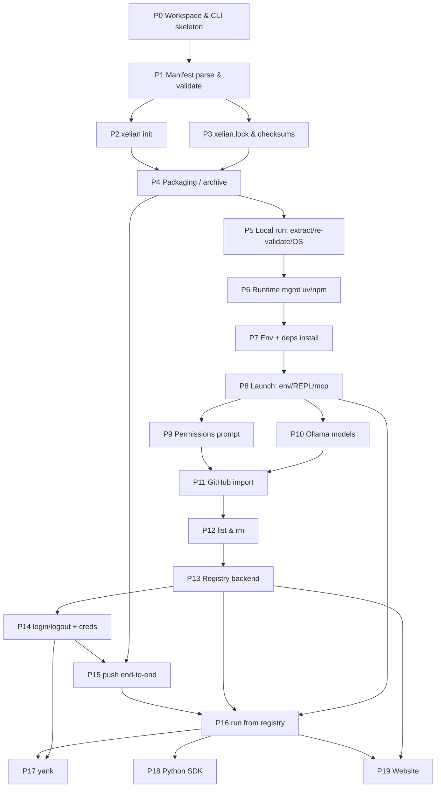

# Xelian Implementation Roadmap

> An engineering roadmap for building Xelian V1, derived strictly from `SPEC.md`.
> `SPEC.md` is the source of truth for all behavior; this document only sequences
> the work. Where the spec is silent, this roadmap records an open question
> rather than inventing behavior.

## How to read this document

- Phases are ordered to build **one vertical slice first** (CLI skeleton →
  manifest → packaging → local run), then to expand outward (GitHub import →
  registry → auth → push → run-from-registry → SDK → website). Do not front-load
  the registry, SDK, or website.
- Each phase is sized for roughly **1–3 days** and ends with a **Demo** a real
  user could run — a "mini launch."
- Every phase strictly builds on the phases before it. Parallel work is avoided
  except where called out.
- All section references (`§9.4`, `§16.1`, …) point at `SPEC.md`.
- **Two time estimates** are given per phase: **(a)** an experienced Rust
  developer, **(b)** the project owner (solo, learning Rust/systems, using
  Claude Code heavily). Both are working estimates, not commitments.

## Suggested top-level repository layout

This is guidance, not an architecture mandate (per project rules, prefer the
simplest thing that works). A Cargo workspace keeps the single-static-binary
goal (§1.3) intact while separating reusable logic from the CLI shell:

```text
xelian/
├── Cargo.toml                 # workspace root
├── crates/
│   ├── xelian-cli/            # bin: clap command surface, thin
│   └── xelian-core/           # lib: manifest, lockfile, packaging, cache, run pipeline
├── registry/                  # Python FastAPI backend (§14)
├── sdk/                       # Python SDK, wraps the CLI (§15)
└── website/                   # Next.js read-only browse/search (§14.9)
```

Suggested modules inside `xelian-core` (introduced as the phases reach them):
`manifest`, `lockfile`, `package` (archive build/extract), `cache` (`~/.xelian/`
layout), `run` (pipeline: `resolve`, `extract`, `runtime`, `env`, `model`,
`launch`), `permissions`, `registry_client`, `github`. Keep the CLI crate a thin
dispatcher that parses arguments and calls into `xelian-core`.

---

# Phase 0 — Workspace & CLI skeleton

**Goal.** A single `xelian` binary that parses every V1 subcommand
(§13.1–§13.9), prints usage/help, and returns "not implemented" for each. Create
the `~/.xelian/` directory scaffolding (§11.1).

**Why.** Establishes the shape of the whole project and the command surface up
front so every later phase fills in a stub rather than inventing structure.
*Builder learns:* Cargo workspaces, `clap` derive, exit codes, the discipline of
a thin CLI shell over a library core.

**Deliverables.**
- [ ] Initialize a Cargo workspace with `xelian-cli` (bin) and `xelian-core` (lib).
- [ ] Wire `clap` with every V1 subcommand: `init`, `push`, `run`, `add`, `list`,
      `rm`, `login`, `logout`, `yank` (§13.10 table is the authoritative list).
- [ ] Model the exact flags per the spec: `rm` takes `--env` and `--all` (§13.6);
      `yank` takes `--version` and `--undo` (§13.9).
- [ ] Each subcommand returns a clear "not yet implemented" message and a
      non-zero exit code.
- [ ] Add a `cache` module that resolves and (lazily) creates the `~/.xelian/`
      tree: `packages/`, `runtimes/`, `envs/`, `models/`, `logs/`, `tmp/`
      (§11.1). Do **not** create or touch `credentials.toml` yet.
- [ ] Global `--version`/`-V` prints the xelian binary version (needed later for
      `xelian.lock`'s `xelian-version`, §7.2).

**Suggested modules/files.** `crates/xelian-cli/src/main.rs` (arg parsing +
dispatch), `crates/xelian-core/src/cache.rs` (path helpers), `xelian-core/src/lib.rs`.

**Acceptance criteria.** `xelian --help` lists all nine commands with correct
flags; each command exits non-zero with a "not implemented" message; running any
command creates the `~/.xelian/` subdirectories (except `credentials.toml`).

**Demo.** `xelian --help` and `xelian run` (prints "not implemented", exits 1).

**Tests.** *Unit:* cache path helpers return expected paths under a temp
`$HOME`. *Integration:* a test harness invokes the built binary with `--help` and
asserts all commands are present. *Manual:* run each subcommand, confirm exit
codes.

**Risks.** Over-engineering the CLI layer; keep it a thin dispatcher. Hard-coding
the home directory instead of resolving it portably (use a home-dir helper).
Creating `credentials.toml` here would violate §11.3's isolation intent.

**Estimated difficulty.** Easy.
**Estimated time.** (a) 0.5 day · (b) 1 day.

---

# Phase 1 — `xelian.toml` parsing & validation

**Goal.** Parse `xelian.toml` into typed Rust structs and validate it against the
full schema: required fields (§6.1), optional fields (§6.2), closed permission
enum (§16.1), closed feature list (§17), naming rules (§19.3), and
`spec-version` support (§6.1). This is `xelian push` step 1 (§8.1) and the
`xelian run` re-validation check (§9.6), implemented once, reused by both.

**Why.** The manifest is the contract at the center of the entire system;
everything downstream (packaging, run, registry) reads it. Building and testing
it in isolation, before any I/O, keeps the hardest correctness rules cheap to
test. *Builder learns:* `serde`/`toml` deserialization, modeling closed enums as
Rust enums, precise validation error messages, table-driven tests.

**Deliverables.**
- [ ] Define typed structs for the manifest mirroring §6.1/§6.2 and Appendix B,
      including `[author]` (§6.1.1), `[dependencies]` (§6.1.2), `[environment]`
      (§6.2.1), `[commands]` (§6.2.2), and an opaque `[config]` blob (§6.3) that
      is captured but never interpreted.
- [ ] Reject unknown `spec-version` values the binary does not implement (§6.1).
- [ ] Enforce required fields present; produce a clear per-field error on
      absence (§8.1 step 1).
- [ ] Validate `permissions` against the closed enum (§16.1) — reject anything
      outside it.
- [ ] Validate `features` against the closed list (§17) — per §17 this is a
      **warning**, not a hard failure (SHOULD, not MUST).
- [ ] Validate `os` values against a recognized OS set when present (§8.1 step 1).
- [ ] Enforce naming rules: lowercase ASCII letters, digits, `_`, `-`, length
      3–64 inclusive (§19.3).
- [ ] Enforce the `[environment]` rule that a variable MUST NOT set both
      `required = true` and `default` (§6.2.1).
- [ ] Do **not** validate `runtime` constraint syntax here — the spec delegates
      that to `uv`/`npm` (§6.1); only capture the string.
- [ ] Expose a single `validate_manifest()` entry point reused by push (§8.1) and
      run (§9.6).

**Suggested modules/files.** `xelian-core/src/manifest.rs` (structs + `validate`),
a `xelian-core/src/errors.rs` for typed validation errors.

**Acceptance criteria.** Valid manifests parse; each invalid case (bad enum,
missing field, bad name length/charset, unsupported `spec-version`,
`required`+`default` conflict) yields a distinct, actionable error. The full
illustrative manifest in §6.4 parses successfully.

**Demo.** No user-facing command yet; demonstrate via `cargo test`. (A hidden
`xelian validate` debug command is optional — but the spec defines no such
command, so keep it out of the public surface.)

**Tests.** *Unit:* one test per validation rule, valid and invalid. Use §6.4 as a
golden valid manifest. *Manual:* hand-edit a manifest to break each rule and
confirm the message.

**Risks.** Silently accepting unknown top-level keys (decide: accept for
forward-compat, but never interpret them — mirror the `[config]` opacity intent).
Over-validating `runtime` (that belongs to `uv`/`npm`, §6.1). Confusing the
features-warn vs permissions-fail distinction (§16.1 vs §17).

**Open items intersecting this phase.** The residual naming TODO at the end of
§19.3 (leading-character rules, reserved names) is unresolved — implement only
the stated charset/length rule and record the residual as an open question.

**Estimated difficulty.** Medium.
**Estimated time.** (a) 1 day · (b) 2 days.

---

# Phase 2 — `xelian init`

**Goal.** `xelian init` scaffolds a new package in the current directory: a
`xelian.toml` and a `xelian.lock`, with no network access (§13.1).

**Why.** It is the simplest command that produces a real artifact and it
exercises the Phase 1 manifest model from the writing side. It gives the builder
a package to feed into packaging (Phase 4). *Builder learns:* file scaffolding,
sensible defaults ("convention over configuration," §1.3), round-tripping the
manifest structs to TOML.

**Deliverables.**
- [ ] Generate a `xelian.toml` skeleton populated with valid defaults and clearly
      marked placeholder values for fields the tool cannot infer (name defaults
      from directory name if it satisfies §19.3, else a placeholder).
- [ ] Generate a minimal `xelian.lock` shell (fields filled in properly in
      Phase 3; here it can be a valid skeleton).
- [ ] Do not contact the network or registry (§13.1).
- [ ] Refuse to clobber an existing `xelian.toml` without explicit intent
      (decide + document the prompt/flag behavior — see open questions).

**Suggested modules/files.** `xelian-core/src/init.rs`, `xelian-cli` dispatch.

**Acceptance criteria.** Running `xelian init` in an empty dir produces a
`xelian.toml` that parses and validates under Phase 1 (modulo intentional
placeholders), plus a `xelian.lock` skeleton; no network call occurs.

**Demo.** `mkdir weather && cd weather && xelian init`.

**Tests.** *Integration:* run `xelian init` in a temp dir, assert both files
exist and the manifest parses. *Manual:* run `init`, then `cargo`-validate.

**Risks.** Emitting a manifest that fails its own validator; keep placeholders
syntactically valid. Silently overwriting a user's existing manifest.

**Open items intersecting this phase.** Exact `init` defaults and whether it
prompts interactively vs. writes placeholders are underspecified (§13.1 only
mandates the two files, no network) — record as an open question and pick the
simplest non-interactive default.

**Estimated difficulty.** Easy.
**Estimated time.** (a) 0.5 day · (b) 1 day.

---

# Phase 3 — `xelian.lock` generation & checksums

**Goal.** Generate a correct `xelian.lock` (§7): all required keys (§7.2),
SHA-256 of the native lockfile when declared (`native-lock-checksum`), and the
package archive checksum (`package-checksum`) computed **excluding `xelian.lock`
itself** (§7.3).

**Why.** Checksums are Xelian's only integrity guarantee in V1 (§20.1), and the
"exclude xelian.lock from its own hash" rule is subtle enough to deserve
isolated, well-tested treatment before packaging depends on it. *Builder learns:*
SHA-256 hashing, deterministic serialization, avoiding circular-hash bugs, ISO
8601 timestamps.

**Deliverables.**
- [ ] Populate all `xelian.lock` keys from §7.2: `spec-version`,
      `xelian-version`, `package-version`, `generated-at` (ISO 8601 UTC),
      `native-manifest`, `native-lockfile`, `native-lock-checksum`,
      `package-checksum`.
- [ ] Compute `native-lock-checksum` as SHA-256 of the native lockfile contents,
      only when a native lockfile is declared (§7.2, §7.3).
- [ ] Implement `package-checksum` computation over final archive contents
      **excluding `xelian.lock`** (§7.3); never hash `xelian.lock` itself.
- [ ] Copy `package-version` from the manifest `version` (§7.2).
- [ ] Ensure the checksum is stable/deterministic given identical inputs.

**Suggested modules/files.** `xelian-core/src/lockfile.rs`, a `checksum` helper in
`xelian-core/src/package.rs` (shared with Phase 4 archive build).

**Acceptance criteria.** A generated `xelian.lock` contains every required key
with correct values; recomputing `package-checksum` on the same inputs is stable;
`xelian.lock` is provably excluded from `package-checksum`.

**Demo.** After `xelian init` + adding files, an internal build step (wired fully
in Phase 4) prints the computed checksum; verify with `sha256sum` against the
same byte set.

**Tests.** *Unit:* checksum determinism; the exclusion of `xelian.lock` from its
own hash (mutating `xelian.lock` does not change `package-checksum`). *Unit:*
native-lock-checksum matches an independent `sha256sum`.

**Risks.** The circular-hash trap (§7.3) — accidentally including `xelian.lock`
in `package-checksum`. Non-deterministic tar/gzip metadata leaking into the hash
(coordinate with Phase 4: normalize timestamps/ordering, or hash the logical file
set rather than raw archive bytes — decide and document).

**Open items intersecting this phase.** §7.3 says `package-checksum` is over
"final archive contents excluding `xelian.lock`" but does not fully pin whether
the hash is over the tar byte stream (minus that entry) or over a canonical file
digest set. Record as an open question; pick one and keep push/run consistent
(§8.3 requires downloader re-verification, §9.4).

**Estimated difficulty.** Medium.
**Estimated time.** (a) 1 day · (b) 1.5 days.

---

# Phase 4 — Packaging: build the `.xelian` archive

**Goal.** Build a spec-conforming `.xelian` archive: a `tar.gz` (§5.1) with the
required layout (§5.2/§5.3), honoring `.gitignore` exclusion semantics (§5.4) and
running the full static validation pipeline (§8.1) — fail-fast (§8.2), no code
execution (§8.4).

**Why.** This completes the *author* side of the vertical slice and is the first
end-to-end artifact another tool (`tar -tzf`) can inspect. It composes Phases 1
and 3. *Builder learns:* tar/gzip in Rust, `.gitignore` matching semantics,
ordered validation pipelines, fail-fast error handling.

**Deliverables.**
- [ ] Implement the §8.1 pipeline in order: (1) parse+validate manifest [Phase 1],
      (2) re-validate any existing `xelian.lock`, (3) verify required files exist
      (§5.3), (4) verify the `entrypoint` path exists and is not `.gitignore`-
      excluded (§5.4/§8.1 step 4), (5) verify each `[commands]` value is a
      non-empty string without executing it (§8.1 step 5, §8.4), (6) compute
      checksum [Phase 3], (7) generate/update `xelian.lock` [Phase 3], (8) build
      the `tar.gz`.
- [ ] Enforce required files: `xelian.toml`, `xelian.lock`, `README.md`, `LICENSE`
      at archive root (§5.3).
- [ ] Apply `.gitignore` exclusion the way `git` evaluates it (§5.4); prefer a
      proven crate (e.g. the `ignore` crate) rather than reimplementing matching.
- [ ] Always exclude `.git/` and any build-scratch dir regardless of
      `.gitignore` (§5.4).
- [ ] Fail packaging if `entrypoint` is itself `.gitignore`-excluded (§5.4).
- [ ] Provide **no** force-include mechanism (§5.4).
- [ ] Fail-fast: stop on first failing step; never produce a partial archive
      (§8.2). No network in this phase (upload is Phase 15).

**Suggested modules/files.** `xelian-core/src/package.rs` (archive build),
`xelian-core/src/validate.rs` (the §8.1 pipeline), reuse `manifest`/`lockfile`.

**Acceptance criteria.** Given a valid package dir, produces a `weather.xelian`
inspectable with `tar -tzf`; a `.gitignore`-listed file never appears in the
archive; missing `LICENSE`/`README.md`/entrypoint each fail with a clear message
and exit non-zero; no declared command is ever executed.

**Demo.** `xelian init` a package, add `README.md`/`LICENSE`/entrypoint, then run
the build (initially exposed as part of `push`'s local half, or a temporary
internal build entry) → `tar -tzf weather.xelian` shows the expected layout.

**Tests.** *Unit:* `.gitignore` exclusion (including nested dirs, negations if the
`ignore` crate supports them), entrypoint-excluded failure. *Integration:* build a
fixture package, extract with system `tar`, diff against expected file set.
*Manual:* build, inspect with `tar -tzf`.

**Risks.** `.gitignore` semantics are deceptively rich (negation, nested files,
anchoring) — lean on the `ignore` crate. Non-deterministic archives breaking
Phase 3 checksums (normalize; coordinate with Phase 3's decision). Accidentally
executing a command during validation (§8.4 forbids it).

**Estimated difficulty.** Hard.
**Estimated time.** (a) 1.5 days · (b) 2.5 days.

---

# Phase 5 — Local run: extract, re-validate, OS check

**Goal.** Begin the `xelian run` pipeline against a **local `.xelian` archive**:
verify checksum (§9.4), extract into the version-scoped cache (§9.5), re-validate
the manifest (§9.6), and enforce the OS compatibility check (§9.6.1). Stop before
runtime/dependency work.

**Why.** This proves the *consumer* half of the archive round-trips with the
*author* half from Phase 4, entirely offline, before any `uv`/`npm`/Ollama
complexity enters. *Builder learns:* the run pipeline skeleton, safe archive
extraction (path traversal defense), cache addressing, defense-in-depth
re-validation.

**Deliverables.**
- [ ] Accept a local archive path as a run target. **Decision (2026-07-16):**
      local-path run is a supported surface, a third target form alongside
      §9.2's registry-ref and GitHub-URL (SPEC.md §9.2 needs a matching
      amendment).
- [ ] Recompute SHA-256 and compare against `package-checksum` before extraction;
      abort on mismatch, do not extract (§9.4).
- [ ] Extract into a package-and-version-scoped dir under `~/.xelian/packages/`
      (§9.5, §11.1); skip re-extraction if the same version already exists (§9.5,
      immutability §19.2).
- [ ] Re-parse and re-validate `xelian.toml` using the Phase 1 validator (§9.6),
      including `spec-version` support.
- [ ] Enforce OS check: if `os` is declared and the current OS is not listed,
      fail immediately with a clear message and proceed no further (§9.6.1).
- [ ] Extract safely: reject absolute paths and `..` traversal in tar entries.

**Suggested modules/files.** `xelian-core/src/run/mod.rs` (pipeline orchestrator),
`xelian-core/src/run/extract.rs`, reuse `cache`, `manifest`, `package`.

**Acceptance criteria.** Running a locally built `weather.xelian` extracts it
under `~/.xelian/packages/…/<version>/` and re-validates; a tampered archive
(checksum mismatch) aborts before extraction; a manifest with an incompatible
`os` fails at the OS check; re-running the same version does not re-extract.

**Demo.** `xelian run ./weather.xelian` → extracts, validates, and stops with a
message like "prepared; runtime launch not yet implemented."

**Tests.** *Unit:* checksum-mismatch abort; OS-check pass/fail; tar path-traversal
rejection. *Integration:* build (Phase 4) then run the same archive, assert cache
contents. *Manual:* corrupt a byte in the archive and confirm abort.

**Risks.** Zip/tar-slip path traversal on extraction — validate entry paths.

**Open items intersecting this phase — RESOLVED (2026-07-16).** Local-path run
is a supported target form, and the cache is **source-based**: contents under
`packages/` (and mirrored under `envs/`) are namespaced by source —
`packages/registry/<owner>/<name>/<version>/`,
`packages/github/<owner>/<repo>/<sha>/`,
`packages/local/<name>/<version>/`. This resolves the owner-less local archive
and SHA-addressed import questions; SPEC.md §11.1 needs a matching amendment.

**Estimated difficulty.** Medium.
**Estimated time.** (a) 1 day · (b) 2 days.

---

# Phase 6 — Language runtime management (`uv` / `npm`)

**Goal.** Implement the runtime-existence step (§9.7): dispatch on `language`,
ensure the runtime manager is present, and auto-install it if missing (§10).
Build the dispatch as **extensible**, not two hardcoded branches (§10.4).

**Why.** "Users never manually install runtimes" (§10.3) is load-bearing for the
Ollama feel; this is the first phase that shells out to external tooling and must
handle its absence gracefully. It precedes dependency install because you cannot
install deps without a runtime. *Builder learns:* process spawning, detecting/
installing external binaries, designing an extensible dispatch trait.

**Deliverables.**
- [ ] Define an extensible runtime-manager dispatch keyed on `language`
      (§10.4) — adding a third language should mean adding a case, not a rewrite.
- [ ] Python path: ensure `uv` is available; auto-install it if absent; use it to
      install/select a CPython satisfying the `runtime` PEP 440 constraint
      (§9.7, §10.1). Delegate constraint parsing to `uv` (§6.1) — do not parse
      PEP 440 in Xelian.
- [ ] Node path: ensure a Node.js runtime satisfying the SemVer range via `npm`;
      auto-install Node if absent (§9.7, §10.2).
- [ ] Store managed runtimes under `~/.xelian/runtimes/` (§11.1) where the tool
      allows directing its install location; otherwise document reliance on the
      tool's own store.
- [ ] Surface clear progress/errors when installing a runtime manager.

**Suggested modules/files.** `xelian-core/src/run/runtime.rs` (dispatch + trait),
`runtime/python.rs`, `runtime/node.rs`, a `proc` helper for spawning.

**Acceptance criteria.** On a machine without `uv`, running a Python package
triggers automatic `uv` install and a CPython matching the constraint; on a
machine without Node, a Node package triggers Node install; the dispatch compiles
cleanly with a placeholder for a hypothetical third language.

**Demo.** On a clean-ish machine, `xelian run ./py-agent.xelian` reaches the
runtime step and provisions `uv` + CPython (then stops before deps until Phase 7).

**Tests.** *Unit:* dispatch selects the right manager per `language`. *Integration
(guarded/manual):* real `uv`/`npm` provisioning is environment-dependent — mark
these manual or CI-gated. *Manual:* uninstall `uv`, run, confirm auto-install.

**Risks.** Auto-installing system tooling is invasive and platform-specific
(macOS/Linux/Windows differences) — pin to documented install methods and fail
loudly. Network failures mid-install. Delegating constraint matching correctly
(do not reimplement PEP 440/SemVer, §6.1).

**Open items intersecting this phase.** Exact `uv`/`npm` invocation details
(subcommands, flags, where CPython/Node land, offline behavior) are not specified
— record concrete command lines as an open question before coding.

**Estimated difficulty.** Hard.
**Estimated time.** (a) 1.5 days · (b) 3 days.

---

# Phase 7 — Environment creation & dependency installation

**Goal.** Create or reuse exactly one isolated environment per `(name, version)`
under `~/.xelian/envs/` (§9.8, §11.1), keyed on `(name, version)` alone (not a
dependency hash), and install dependencies by delegating to the native manager
(`uv`/`npm`) against the package's native manifest/lockfile (§9.8).

**Why.** This is the step that makes a package actually runnable and the last
piece before launch. It depends on Phase 6's runtime provisioning. *Builder
learns:* environment isolation, cache-key design, delegating to native managers
(§1.3: "native package managers remain the source of truth").

**Deliverables.**
- [ ] Cache-key environments strictly on `(name, version)` (§9.8) — no dependency
      hashing (the rationale in §9.8 explicitly rejects it).
- [ ] Reuse an existing environment for a `(name, version)` on subsequent launches
      rather than rebuilding (§9.8).
- [ ] Install dependencies via the native manager referenced by `dependencies`
      (§6.1.2): `uv` (Python) / `npm` (Node), operating on the native
      manifest+lockfile (§9.8). Never re-declare or re-resolve deps in Xelian.
- [ ] Address environments mirroring the source-based cache layout decided in
      Phase 5 (`envs/registry/…`, `envs/github/…`, `envs/local/…`).

**Suggested modules/files.** `xelian-core/src/run/env.rs`, reuse
`run/runtime.rs`.

**Acceptance criteria.** First run of a package builds an env under
`~/.xelian/envs/…/<version>/` and installs deps via the native manager; second
run reuses it without reinstalling; deleting the env forces a rebuild.

**Demo.** `xelian run ./py-agent.xelian` twice: first is slow (installs), second
is fast (reuses env), both reach the pre-launch boundary.

**Tests.** *Unit:* env cache-key derivation is `(name, version)` only.
*Integration:* run twice, assert second run skips install. *Manual:* inspect
`~/.xelian/envs/` after a run.

**Risks.** Partial/corrupt environments if install is interrupted — consider a
temp-then-rename into `~/.xelian/tmp/` (§11.1) for atomicity. Assuming a native
lockfile exists when it may not (§6.1.2 says `lockfile` is SHOULD, not MUST).

**Estimated difficulty.** Hard.
**Estimated time.** (a) 1.5 days · (b) 3 days.

---

# Phase 8 ✅ — Launch: env vars, agent REPL, MCP stdio + port fallback

**Status: implemented (H-080, H-081, H-082).**

**Goal.** Implement the launch step (§9.10) for **both** package types: validate
required env vars and apply defaults (§6.2.1, §9.10); launch `agent` attached to
the terminal as a REPL (§9.10.1); launch `mcp` as a stdio server with port
fallback (§9.10.2). This closes the local vertical slice.

**Why.** This is the payoff phase — after it, `xelian run ./weather.xelian`
delivers the Ollama-like experience end to end, entirely locally. It depends on a
provisioned env (Phase 7). *Builder learns:* process spawning with inherited
stdio, terminal attachment, MCP stdio transport, port binding/fallback.

**Deliverables.**
- [ ] Immediately before launch: verify each `required = true` env var is present;
      abort with a clear error without launching if missing (§6.2.1, §9.10).
- [ ] Apply `default` values for unset, non-required env vars before launch
      (§6.2.1).
- [ ] `agent`: attach the entrypoint's stdin/stdout/stderr to the user's terminal
      (interactive REPL); block for the session's duration (§9.10.1).
- [ ] `mcp`: launch as a server over **stdio** (the V1-required transport,
      §9.10.2).
- [ ] `mcp` HTTP exposure: per the 2026-07-16 decision, `port` governs local
      **HTTP** exposure of the MCP server. If `port` is declared, try it first;
      if unavailable, auto-select a free port and inform the user which was
      chosen (§9.10.2).
- [ ] Launch using the Phase 7 environment (§9.10).

**Suggested modules/files.** `xelian-core/src/run/launch.rs` (type dispatch),
`run/env_vars.rs` (required/default resolution).

**Acceptance criteria.** An `agent` package drops into an interactive REPL; a
missing required env var aborts before launch with a clear message; a defaulted
env var is populated; an `mcp` package starts over stdio; when its declared port
is busy, Xelian picks another and prints it.

**Demo.** `xelian run ./weather.xelian` → chat REPL. For an MCP package:
`xelian run ./some-mcp.xelian` → stdio server announced (with the actual port if
`port` was set and taken).

**Tests.** *Unit:* required/default env resolution (missing required → abort;
default applied). *Integration:* launch a trivial fixture agent, send input, read
output; launch a trivial MCP stdio server and complete a handshake; occupy the
declared port and assert fallback + user notification. *Manual:* real REPL
interaction.

**Risks.** stdio attachment/TTY behavior differs across platforms and when not a
real terminal. The interaction between MCP-over-stdio and a `port` field is
conceptually muddy — stdio has no port; clarify what `port` means for a stdio
server (open question, §9.10.2). Zombie/orphan child processes on abnormal exit.

**Open items intersecting this phase — RESOLVED (2026-07-17).**
Decision: `port` governs local **HTTP** exposure of the MCP server; stdio
remains the required process transport. Bridge-vs-passthrough: **passthrough**
— Xelian resolves the port (declared → probed, busy → OS-assigned free port,
announced on stderr) and passes it via `PORT`; the child does the actual bind.
`PORT` is injected **only when the manifest declares `port`** — stdio-only
servers see no synthetic env vars. All Xelian diagnostics for `run` go to
**stderr**: an MCP child inherits Xelian's stdout as its JSON-RPC transport,
so stdout must carry nothing but the protocol. SPEC.md §9.10.2/§23 still need
a matching amendment.

**Estimated difficulty.** Hard.
**Estimated time.** (a) 2 days · (b) 3.5 days.

---

# Phase 9 ✅ — Permissions: first-run prompting (disclosure-only)

**Status: implemented (H-090).**

**Goal.** Prompt the user to grant/deny each declared permission on the **first
run of a given package version** (§16.2); do not re-prompt on later runs of an
already-granted version; enforce nothing technically (disclosure-only, §16.2,
§20.4).

**Why.** Permissions gate the launch UX and must sit in front of the launch step,
but they carry no runtime enforcement in V1, so they are a small, self-contained
addition after launch works. *Builder learns:* persisting first-run state per
`(name, version)`, terminal prompting, resisting scope creep (no sandboxing).

**Deliverables.**
- [ ] On first run of a `(name, version)`, display each declared permission
      (§16.1) and prompt grant/deny (§16.2).
- [ ] Persist the grant decision so subsequent runs of the same version do not
      re-prompt (§16.2, SHOULD NOT re-prompt).
- [ ] Do **not** sandbox or restrict actual access — disclosure only (§16.2,
      §20.4).
- [ ] Slot the prompt at the correct pipeline position (before launch, §9.10).

**Suggested modules/files.** `xelian-core/src/permissions.rs`, a small
grant-state store under `~/.xelian/` (decide location — see open questions).

**Acceptance criteria.** First run of a version prompts for each declared
permission; a second run of the same version does not; nothing about actual
process access changes (documented as disclosure-only).

**Demo.** `xelian run ./weather.xelian` on a fresh cache prompts
"network / filesystem — allow?"; the next run does not.

**Tests.** *Unit:* first-run detection per `(name, version)`; no re-prompt after
grant. *Manual:* run twice, observe prompt then silence.

**Risks.** Where grant-state lives is unspecified (not in `credentials.toml`,
§11.3; probably alongside the extracted package or a small state file) — pick a
location that survives `xelian rm` semantics sensibly (open question).
Over-building toward enforcement (explicitly future work, §23).

**Open items intersecting this phase — RESOLVED (2026-07-17).**
Grant state lives at `~/.xelian/permissions/local/<name>/<version>.toml`
(`XelianHome::local_grants_path`) — deliberately **outside** the extracted
package cache, so a package cannot ship a pre-filled grants file that
suppresses its own first-run prompt, and cache removal doesn't silently
destroy consent history. A **deny** is recorded but launch proceeds
(disclosure-only, §20.4). Non-interactive stdin (CI, pipes, MCP clients):
permissions are disclosed on stderr, nothing is prompted or persisted —
stdin belongs to the child and silence is not consent.

**Estimated difficulty.** Easy.
**Estimated time.** (a) 0.5 day · (b) 1 day.

---

# Phase 10 ✅ — Ollama model management

**Status: implemented (H-100, H-101).**

**Goal.** Implement the model step (§9.9, §18): if `primary-model` is declared and
absent, download it before launch; if Ollama itself is absent, auto-install it
first (§9.9, §18).

**Why.** This completes the batteries-included promise for model-backed agents and
is the final piece of the local run pipeline (step 10 of §9.1). It comes after
launch works so it can be tested end to end. *Builder learns:* integrating an
external daemon (Ollama), auto-installing it, model caching.

**Deliverables.**
- [ ] If `primary-model` is declared and not present in `~/.xelian/models/`
      (§11.1) or Ollama's own store, download it before launch (§9.9, §18).
- [ ] If the Ollama binary/daemon is absent, auto-install it before any model
      download (§9.9, §18) — consistent with §10.3's "never manually install."
- [ ] Cache downloaded models and reuse them on future runs (§18, §9.11 — no
      implicit eviction).
- [ ] Sequence the model step correctly (pipeline step 10, before launch step 11,
      §9.1).

**Suggested modules/files.** `xelian-core/src/run/model.rs`.

**Acceptance criteria.** A package declaring `primary-model` downloads it on first
run if missing; Ollama is auto-installed when absent; a second run reuses the
cached model.

**Demo.** `xelian run ./weather.xelian` where `xelian.toml` sets
`primary-model = "llama3"` → Ollama installed if needed, model pulled, then REPL.

**Tests.** *Integration (guarded/manual):* real model pulls are large/slow —
gate behind a manual or opt-in test. *Unit:* "model present" detection logic.
*Manual:* remove Ollama, run, confirm auto-install + pull.

**Risks.** Ollama install is platform-specific and heavy; model pulls are large.
Deciding whether Xelian's `~/.xelian/models/` is authoritative vs. Ollama's own
store (§9.9 references both) — clarify to avoid double storage (open question).

**Milestone significance.** *The full local run pipeline (§9.1 steps 4–11) now
works offline against a locally built package.* This is Xelian's core idea proven
without a registry.

**Estimated difficulty.** Medium.
**Estimated time.** (a) 1 day · (b) 2 days.

---

# Phase 11 — GitHub import (`xelian add`)

**Goal.** Implement `xelian add <github-url>` (§12): resolve the default branch to
a commit SHA, download at that SHA, detect language by precedence, infer a
`xelian.toml` with placeholders, generate `xelian.lock`, build the package, cache
it addressed by SHA, and run it through the pipeline "from step 6 onward" (§12.2).

**Why.** It reuses the entire local run pipeline (Phases 4–10) with a new front
end and needs no registry, so it belongs immediately after the local slice and
before any Python work — keeping the builder in Rust longer. *Builder learns:*
GitHub archive fetch, SHA addressing for reproducibility, manifest inference,
placeholder semantics.

**Deliverables.**
- [ ] Resolve the repo's default branch to a specific commit SHA; download at that
      SHA; cache/address **by SHA, not branch** (§12.2 step 1).
- [ ] Language detection by precedence: `pyproject.toml` → python;
      `package.json` → node; `Cargo.toml` → fail with a clear "unsupported
      language" error (§12.2 step 2). Make the detection list extensible
      (append-a-check, not redesign — §12.2).
- [ ] Infer `language`, `runtime`, `entrypoint`, `dependencies` from project
      structure; give every other required/optional field a placeholder (§12.2
      step 3). Do not fail merely because non-inferable fields are placeholders.
- [ ] Generate `xelian.lock` (§12.2 step 4) and build the `.xelian` internally
      (§12.2 step 5).
- [ ] Cache under `~/.xelian/packages/` addressed by SHA (§12.2 step 6).
- [ ] Run from manifest validation onward (§12.2 step 7, i.e. §9.6+).
- [ ] Do **not** publish anything (§12.3) — import is local-only, distinct from
      push.

**Suggested modules/files.** `xelian-core/src/github.rs` (fetch + SHA resolve +
inference), reuse `package`, `lockfile`, `run`.

**Acceptance criteria.** `xelian add <python-repo-url>` produces a cached package
addressed by SHA and launches it; a Rust repo fails with a clear unsupported-
language error; re-importing the same repo resolves to the same SHA and reuses
cache; nothing is pushed to any registry.

**Demo.** `xelian add https://github.com/owner/some-python-agent` → runs.

**Tests.** *Unit:* language-detection precedence; SHA addressing. *Integration:*
import a small fixture repo (or a vendored tarball) and assert cache + run.
*Manual:* import a real small public agent repo.

**Risks.** GitHub API/rate limits and unauthenticated fetch limits; entrypoint
inference is genuinely ambiguous for arbitrary repos (placeholder + require user
edit before push, §12.2/§12.3). Reconcile SHA-based cache addressing with the
`packages/<owner>/<name>/<version>/` layout (§11.1 assumes version, not SHA) —
open question.

**Open items intersecting this phase — RESOLVED (2026-07-16).** Imports live in
the source-based cache decided in Phase 5: `packages/github/<owner>/<repo>/<sha>/`.

**Estimated difficulty.** Hard.
**Estimated time.** (a) 2 days · (b) 4 days.

---

# Phase 12 — `xelian list` & `xelian rm`

**Goal.** Implement local cache inspection and removal: `xelian list` (§13.5) and
`xelian rm` with `--env` and `--all` (§13.6), respecting credential isolation
(§11.3).

**Why.** These operate purely on the now-populated cache (from local runs and
imports) and are small, high-value wins that also make later phases easier to
debug. *Builder learns:* cache traversal, safe recursive deletion, honoring
isolation invariants.

**Deliverables.**
- [ ] `xelian list`: list locally cached packages only — not a registry search
      (§13.5, §22).
- [ ] `xelian rm owner/package`: remove all cached versions of that package but
      leave its environment(s) intact (§13.6).
- [ ] `xelian rm owner/package --env`: also remove its cached environment (§13.6).
- [ ] `xelian rm --all`: remove everything under `packages/`, `envs/`,
      `runtimes/`, `models/` — but **never** `credentials.toml` (§13.6, §11.3).
- [ ] `xelian rm` affects only local cache; never the registry (§13.6).

**Suggested modules/files.** `xelian-core/src/cache.rs` (list/remove helpers),
CLI dispatch.

**Acceptance criteria.** `xelian list` shows cached packages; `xelian rm` removes
the package but keeps its env unless `--env`; `xelian rm --all` clears the four
cache dirs and leaves `credentials.toml` untouched.

**Demo.** `xelian list`, then `xelian rm owner/weather --env`, then
`xelian rm --all`.

**Tests.** *Unit:* removal preserves `credentials.toml`; `--env` toggles env
deletion. *Integration:* populate cache, list, remove, assert filesystem state.

**Risks.** Recursive delete on a mis-resolved path (guard against deleting outside
`~/.xelian/`). Accidentally removing `credentials.toml` on `--all` (§11.3
forbids). `xelian list` needs a stable owner/name/version view — depends on the
Phase 5/11 cache-addressing decision.

**Estimated difficulty.** Easy–Medium.
**Estimated time.** (a) 0.5 day · (b) 1 day.

---

# Phase 13 — Registry backend (FastAPI): data model + three baseline routes

**Goal.** Stand up the FastAPI registry (§14): the data model (§14.2), the three
ratified routes (§14.8), publish-time checks (§14.5), immutability (§19.2), and
resolution excluding yanked/pre-release (§14.3, §19.1). No auth yet (Phase 14).

**Why.** This begins the outward expansion and is the first Python component. It
must exist before `xelian push`/`xelian run`-from-registry can be wired. Building
it before auth lets the data model and resolution logic be tested in isolation.
*Builder learns:* FastAPI, REST modeling, immutability enforcement, SemVer
resolution server-side.

**Deliverables.**
- [ ] Implement the data model: `Account`, `Package` (namespace = owner),
      `Versions[]` with version, archive, checksum, `xelian.lock`, README,
      metadata, `published_at`, `yanked` (§14.2).
- [ ] `POST /packages` — publish a new version (§14.8), with receipt checks: the
      uploaded archive's SHA-256 matches `package-checksum` in the accompanying
      `xelian.lock` (§14.5), and `(name, version)` is not already published
      (§14.5, §19.2). Never execute the package (§14.1, §14.5).
- [ ] `GET /packages/{owner}/{package}` — return metadata for the resolved latest
      version (§14.8).
- [ ] `GET /download/{owner}/{package}/{version}` — return that version's archive
      (§14.8).
- [ ] Resolution: highest SemVer that is not yanked and not pre-release; clear
      error if none (§14.3, §19.1).
- [ ] Enforce immutability: republishing an existing `(name, version)` fails
      (§19.2, §14.6 — no in-place update path).
- [ ] No registry-side search endpoint (§14.1, §22).

**Suggested modules/files.** `registry/app/main.py`, `registry/app/models.py`,
`registry/app/storage.py` (archive+metadata store), `registry/app/resolution.py`.

**Acceptance criteria.** Can publish a version via `POST /packages`, fetch its
metadata, and download its archive; republishing the same `(name, version)`
fails; resolution skips yanked and pre-release versions; the server never
executes uploaded code.

**Demo.** With the FastAPI server running, `curl` the three routes: publish a
built `.xelian`, `GET` its metadata, `GET` its archive.

**Tests.** *Unit:* SemVer resolution excludes yanked/pre-release; immutability
rejection. *Integration:* publish→fetch→download round-trip; duplicate publish
rejected. *Manual:* `curl` each route.

**Risks.** Storage design (DB vs. filesystem for archives) is unspecified — keep
it simple (local storage is fine for V1). Exact request/response schemas are left
to implementation (§14.8) — must be pinned before the CLI client (Phase 15/16)
can integrate (open question). Server-side checksum recompute must match the
Phase 3 convention exactly.

**Open items intersecting this phase.** Exact request/response schemas for the
three routes are explicitly "left to implementation" (§14.8) — define them here
and record as the canonical contract for Phases 15–16.

**Estimated difficulty.** Hard.
**Estimated time.** (a) 2 days · (b) 4 days.

---

# Phase 14 — `xelian login` / `xelian logout` + credentials

**Goal.** Implement browser-based OAuth login (§13.7, §14.4), store the credential
in `~/.xelian/credentials.toml` with `0600` permissions (§11.1, §14.4), and
`xelian logout` to remove it (§13.8). Add the corresponding registry auth
route(s) (TODO-15).

**Why.** Auth must exist before the registry-mutating commands (`push`, `yank`).
It builds on the Phase 13 registry. *Builder learns:* OAuth device/callback
flows, secure credential storage, file permission bits.

**Deliverables.**
- [ ] `xelian login`: browser-based OAuth flow (like `gh auth login`/
      `docker login`, §13.7); obtain and store a credential.
- [ ] Write `credentials.toml` at `~/.xelian/` top level with `0600` permissions
      (§11.1, §14.4); never inside cache subdirs (§11.3).
- [ ] `xelian logout`: remove the stored credential (§13.8).
- [ ] Add the registry-side auth route(s) needed for the flow (TODO-15 sketches
      an OAuth token/callback route pair, non-normative).
- [ ] Send the credential on registry-mutating requests (§14.4) — consumed by
      Phases 15 and 17.

**Suggested modules/files.** `xelian-core/src/auth.rs` (login flow + credential
store), `registry/app/auth.py` (token/callback routes).

**Acceptance criteria.** `xelian login` completes a browser flow and writes
`credentials.toml` with `0600`; `xelian logout` removes it; `xelian rm --all`
leaves it intact (verified against Phase 12); an authenticated request is
accepted by the registry.

**Demo.** `xelian login` (browser opens, approve), then `xelian logout`.

**Tests.** *Unit:* credential file is written `0600`; logout removes it.
*Integration:* mock OAuth provider, complete flow, assert stored token. *Manual:*
real browser flow.

**Risks.** OAuth flow details are unspecified (TODO-15): provider, device vs.
authorization-code, callback handling, token format/refresh — must be decided
before coding (open question). Loopback-callback port handling. Cross-platform
`0600` semantics (Windows ACLs).

**Open items intersecting this phase.** TODO-15 — exact `xelian login` route
shape and OAuth mechanics are open. Resolve before implementation.

**Estimated difficulty.** Medium.
**Estimated time.** (a) 1.5 days · (b) 2.5 days (plus OAuth-decision time).

---

# Phase 15 — `xelian push` end-to-end

**Goal.** Wire the Phase 4 packaging pipeline to the registry: run full local
validation (§8.1), then upload to `POST /packages` authenticated (§13.2, §14.5),
rejecting already-published `(name, version)` (§19.2).

**Why.** This connects author-side packaging (Phase 4), auth (Phase 14), and the
registry (Phase 13) into the first half of the publish→run loop. *Builder learns:*
authenticated multipart upload, mapping local validation failures to non-zero
exits before any network call.

**Deliverables.**
- [ ] Run the full §8.1 validation pipeline locally before any network activity
      (§13.2) — reuse Phase 4.
- [ ] Upload the built `.xelian` (and its `xelian.lock`) to `POST /packages`
      with the credential from Phase 14 (§13.2, §14.4/§14.5).
- [ ] Reject client-side and honor server-side rejection of an already-published
      `(name, version)` (§19.2, §14.5).
- [ ] Enforce the author/namespace authorization match (§14.4) — owner in
      `owner/name` must match the authenticated account (server-enforced;
      client surfaces the error).
- [ ] Fail-fast: no upload if any validation step fails (§8.2).

**Suggested modules/files.** `xelian-core/src/registry_client.rs` (HTTP client),
CLI `push` dispatch, reuse `validate`/`package`/`auth`.

**Acceptance criteria.** `xelian push` on a valid, authenticated package uploads
it and it becomes resolvable via the registry; a validation failure aborts before
any network call; republishing the same version fails; pushing to a namespace you
do not own is rejected.

**Demo.** `xelian login` then `xelian push` from a package directory → version
appears on the registry.

**Tests.** *Integration:* push→then fetch metadata via Phase 13 routes.
*Unit:* validation-failure aborts before network (assert no request sent).
*Manual:* full `login`+`push`.

**Risks.** Large-archive upload handling/timeouts. Ensuring local validation truly
precedes any socket open (§8.1/§13.2). Checksum agreement between client
(`xelian.lock`) and server recompute (§14.5).

**Estimated difficulty.** Medium–Hard.
**Estimated time.** (a) 1.5 days · (b) 3 days.

---

# Phase 16 — `xelian run` from the registry

**Goal.** Complete the run pipeline's front end for the registry target form
(§9.2): resolve `owner/package` to the latest stable non-yanked version (§9.2,
§14.3), check cache (§9.3), download if absent (§9.3), then feed into the existing
Phase 5–10 pipeline (checksum → extract → … → launch).

**Why.** This closes the core loop: a *second machine* can run what the first
published. It is the single most important integration in the project and depends
on the registry (13), push (15), and the local pipeline (5–10). *Builder learns:*
registry resolution client-side, cache-hit short-circuiting, wiring a new target
form into an existing pipeline.

**Deliverables.**
- [ ] Syntactically distinguish the three target forms — registry ref,
      GitHub URL, and local `.xelian` path (per the 2026-07-16 decision) —
      before resolving; reject any other input rather than guessing (§9.2).
- [ ] Resolve `owner/package` to the highest stable, non-yanked, non-pre-release
      version via `GET /packages/{owner}/{package}` (§9.2, §14.3, §19.1). No
      `@version` pin syntax (§9.2, §22).
- [ ] Check `~/.xelian/packages/` for the resolved exact version before any
      network request; skip download on hit (§9.3).
- [ ] Download the archive via `GET /download/{owner}/{package}/{version}` when
      absent (§9.3), staging through `~/.xelian/tmp/` (§11.1).
- [ ] Verify checksum (§9.4) then hand off to the existing Phase 5–10 pipeline.
- [ ] Persist cache indefinitely; no implicit eviction (§9.11).

**Suggested modules/files.** `xelian-core/src/run/resolve.rs` (target parsing +
registry resolution), reuse `registry_client`, `run`.

**Acceptance criteria.** On a machine with an empty cache, `xelian run
owner/package` resolves, downloads, verifies, and launches; a second run uses the
cache with no network; a yanked-latest resolves to the next version (verified in
Phase 17); an unknown package fails clearly.

**Demo.** `xelian run janedoe/research_assistant` on a fresh machine → REPL (the
Appendix C.2 walkthrough).

**Tests.** *Integration:* end-to-end publish (Phase 15) → run-from-registry on a
clean cache. *Unit:* target-form discrimination (registry vs. GitHub vs. invalid);
cache-hit skips network. *Manual:* run on a second machine/container.

**Risks.** Ambiguous target parsing (a name with a slash vs. a URL) — §9.2
requires syntactic discrimination and hard failure on anything else. Partial
downloads (stage in `tmp/`, verify checksum before moving into `packages/`).

**Milestone significance.** *The Ollama-equivalent core loop — publish once, run
anywhere with zero setup — is fully working.* This is Xelian V1's central success
criterion (CLAUDE.md success criteria; Appendix C.1–C.2).

**Estimated difficulty.** Hard.
**Estimated time.** (a) 1.5 days · (b) 3 days.

---

# Phase 17 — `xelian yank`

**Goal.** Implement `xelian yank owner/package --version <v>` and `--undo`
(§13.9), backed by a registry yank/unyank route (TODO-15), with the exact
semantics of §14.7.1 (visibility change only, never byte deletion).

**Why.** Yank depends on auth (14), the registry (13), and resolution (16); it
completes the owner-facing lifecycle. *Builder learns:* mutable-flag operations
under an immutability invariant, authorization checks, semantic-versioning
resolution interaction.

**Deliverables.**
- [ ] `xelian yank owner/package --version <v>`: authenticated as owner (§14.4),
      mark `yanked = true` (§14.7.1).
- [ ] `--undo`: set `yanked = false` (§14.7.1).
- [ ] Yanked versions are excluded from resolution (§14.3, §14.7.1) — verify
      against Phase 16.
- [ ] Never delete archive, checksum, or metadata; never affect already-cached
      clients (§14.7.1). No self-service hard delete (§14.7.2, §22).
- [ ] Add the registry yank/unyank route (TODO-15 sketches
      `PATCH /packages/{owner}/{package}/{version}`, non-normative).

**Suggested modules/files.** `xelian-core/src/registry_client.rs` (yank call),
`registry/app/` yank route, CLI `yank` dispatch.

**Acceptance criteria.** Yanking the latest version causes `xelian run` to resolve
to the next non-yanked version (or fail clearly if none, §14.3); `--undo`
restores it; the archive bytes are never removed; a non-owner cannot yank.

**Demo.** `xelian yank janedoe/research_assistant --version 1.2.0` then
`xelian run janedoe/research_assistant` resolves to the prior version
(Appendix C.4).

**Tests.** *Integration:* publish two versions, yank the higher, assert resolution
falls back; `--undo` restores. *Unit:* authorization rejection for non-owner.
*Manual:* full yank/undo cycle.

**Risks.** Authorization must be server-enforced, not just client-side (§14.4).
The yank route shape is open (TODO-15) — align with the Phase 14 auth decision.

**Open items intersecting this phase.** TODO-15 — the yank/unyank route shape is
open. TODO-20 (administrative hard delete) is explicitly *not* in V1 scope and
must not be built here.

**Estimated difficulty.** Medium.
**Estimated time.** (a) 1.5 days · (b) 2.5 days.

---

# Phase 18 — Python SDK

**Goal.** Ship the Python SDK that **wraps the CLI** (§15.1 — never reimplements
resolution/validation/execution) and exposes `install`, `run`, `agent`, `mcp`
plus `.chat()`/`.expose()` (§15.2).

**Why.** The SDK is a thin client over the now-complete CLI; building it last
means it wraps a stable surface. *Builder learns:* subprocess orchestration from
Python, mapping package-type to handle types, packaging a Python library.

**Deliverables.**
- [ ] `xelian.install(target)`: perform pipeline steps 1–9 without launching
      (§15.2) — shell out to the CLI's prepare path.
- [ ] `xelian.run(target)`: full pipeline (§9.1); return a handle matching the
      package-type (§15.2).
- [ ] `xelian.agent(target)` / `xelian.mcp(target)`: behave like `run` but raise
      if `package-type` mismatches (§15.2).
- [ ] Handle `.chat()` for agents and `.expose()` for MCP servers (§15.2).
- [ ] Wrap the CLI only — do not reimplement pipeline logic (§15.1).

**Suggested modules/files.** `sdk/xelian/__init__.py` (top-level functions),
`sdk/xelian/handles.py` (agent/mcp handles), `sdk/pyproject.toml`.

**Acceptance criteria.** From Python, `xelian.run("owner/pkg").chat("hi")` returns
a response; `xelian.agent()` on an MCP package raises; `xelian.mcp().expose()`
makes the local server available to an MCP client; `install()` prepares without
launching.

**Demo.** A short Python REPL session: `import xelian; xelian.run("owner/pkg")`.

**Tests.** *Unit:* type-mismatch raises for `agent`/`mcp`; `install` does not
launch. *Integration:* drive a fixture agent via `.chat()`. *Manual:* run the §15.2
example snippet.

**Risks.** The handle's methods beyond `.chat()`/`.expose()`, sync vs. async, and
streaming are open (TODO-29) — implement the four documented entry points and the
two documented methods; defer the rest. Robust subprocess I/O framing (how
`.chat()` maps onto the CLI's interactive REPL) is genuinely tricky.

**Open items intersecting this phase.** TODO-29 — handle method surface beyond
`.chat()`/`.expose()`, sync/async, streaming, remain open. Also underspecified:
how `.chat()` communicates with an interactive CLI REPL vs. a non-interactive
mode. Record before coding.

**Estimated difficulty.** Medium–Hard.
**Estimated time.** (a) 1.5 days · (b) 2.5 days.

---

# Phase 19 — Website (read-only browse/search)

**Goal.** A Next.js site that consumes the registry API **read-only** for browsing
and search, with no privileged write access (§14.9), displaying declared
permissions (§16.3) and features (§17).

**Why.** Discovery is the website's job, not the CLI's or registry's (§14.1); it
comes last because it depends on a populated registry. *Builder learns:* Next.js
data fetching against the registry API, rendering package metadata/README.

**Deliverables.**
- [ ] Browse/search over registry packages, read-only (§14.9).
- [ ] Package page rendering README (§14.2) and metadata (description, tags,
      permissions, features from `xelian.toml`, §14.2).
- [ ] Display declared permissions so users can evaluate before running (§16.3).
- [ ] Display declared features (§17).
- [ ] No write access beyond what an authenticated CLI account could do — same API
      client, not a separate control plane (§14.9).

**Suggested modules/files.** `website/` Next.js app; a small registry API client
module.

**Acceptance criteria.** The site lists/searches published packages, renders a
package page with README, permissions, and features, and has no write path beyond
the public registry API.

**Demo.** Open the site, search for a published package, view its page.

**Tests.** *Integration:* site fetches and renders a published package's metadata.
*Manual:* browse/search against a running registry with a few published packages.

**Risks.** Search implementation scope creep — §22 excludes *CLI-driven* search,
but website search is in scope (§14.9); keep it simple (registry API-backed). The
website needs a search-capable registry read surface; §14.8 only ratifies three
routes and excludes registry *search* — clarify how website search is served
(open question; may be a website-only concern over metadata it already fetches).

**Estimated difficulty.** Hard.
**Estimated time.** (a) 2 days · (b) 3.5 days.

---

# Phases 20–25 — Productionization & launch (added 2026-07-18)

> V1 behavior is code-complete (Phases 0–18). These phases contain no new
> product features — they make the existing product shippable, trustworthy, and
> discovered. Task-level detail lives in `BACKLOG.md` (H-200…H-255); this
> section records the goals and the decisions.

**Infrastructure decision of record (revised 2026-07-18: $0/month until
traction).** Everything on free tiers, launch included: GitHub (code, CI,
release binaries), Vercel (Next.js website), **Neon managed Postgres free tier
as the one and only database from day one — no SQLite anywhere** (SQLAlchemy
behind a single `DATABASE_URL`; dev and CI run against real Postgres via a
Docker service container so tests exercise the exact engine prod uses),
Cloudflare R2 (archive blobs, 10 GB free), PyPI (SDK), and the registry API on
a free host (e.g. Render free tier). Two consequences of free hosting are
accepted knowingly: (1) idle spin-down cold starts — mitigated cheaply by a
free uptime pinger hitting `/health` every 5 minutes to keep the instance warm;
(2) **ephemeral disks — which makes R2 for archive storage REQUIRED, not
optional**, or published packages vanish on every redeploy. Archives are never
stored in the database — metadata rows only. Paid always-on hosting is
revisited only after users (and then funding) justify it.

**Phase 20 — Rename & repo foundation.** Resolve the name collision with CNCF
Harbor (goharbor.io — a famous *registry* where `harbor push` already means
something else) before any public artifact exists; claim GitHub/domain/PyPI/
crates/Homebrew names. Then the storefront: a README a stranger can go
zero-to-running-agent from (30s GIF, 3-command quickstart, package-in-5-minutes
guide), LICENSE, CONTRIBUTING, SECURITY, issue/PR templates, Discussions.
*Why first:* renaming after launch is a disaster; the README is the highest-
leverage artifact in the repo. **Demo:** a friend stars the repo and gets an
agent running without asking you anything.

**Phase 21 — CI & testing to an "insane" bar.** Unit/clippy/fmt CI on macOS +
Linux; a full E2E job that boots the real registry and drives the real binary
through login→push→409→clean-run→yank→unyank→rm; a cross-implementation
checksum golden-fixture test (Rust and Python must agree byte-for-byte — the
class of test that would have caught the checksum-dialect bug that shipped
green); a Docker clean-machine job running the public install script verbatim;
fuzz/abuse tests (tar bombs, oversize uploads, traversal payloads, concurrent
publishes); SDK-against-real-binary integration tests; a load sanity test.
*Rule:* the two sides of every contract are tested against each other, never
only against themselves. **Demo:** CI goes red when any of it lies.

**Phase 22 — Production registry.** Postgres data layer (`DATABASE_URL`, Neon
free tier in prod, Docker Postgres in CI — no SQLite); real signup with hashed
passwords and DB-persisted revocable tokens (the in-memory token dict currently
logs everyone out on restart; the `admin/admin` fallback is removed — refuse to
start unconfigured); upload caps, decompression-bomb guards, streamed
downloads, timeouts, rate limits; non-interactive login (`--password-stdin` /
`XELIAN_TOKEN` — rpassword hard-fails without a TTY today) and env-var URL
precedence; a `/search` endpoint + `xelian search` (there is currently no way
to discover packages at all); deploy at `registry.<domain>` over HTTPS on a
free host with R2-backed archive storage (ephemeral free-tier disks make R2
mandatory), backups, a keep-warm `/health` pinger, and a compiled-in production
default URL. **Demo:** a stranger signs up, publishes, and someone else runs
their package — with you on vacation.

**Phase 23 — Distribution.** Release workflow cross-compiling macOS/Linux
binaries to GitHub Releases; a product-quality `curl | sh` install script;
Homebrew tap; SDK on PyPI (PATH-first binary lookup — the repo-relative
`target/debug` lookup must not ship); Windows either verified in CI or
explicitly and gracefully scoped out. **Demo:** `brew install` → `xelian run`
→ chatting, on a machine you've never touched.

**Phase 24 — Seed content & private beta.** 15–20 real packages under an
official namespace (the most-wanted MCP servers + a few genuinely fun agents) —
an empty registry is a dead registry and this outranks all remaining polish;
5–10 clean-machine beta users with every stumble filed and fixed, until two of
them publish independently; pre-package the tools of the specific creators you
plan to contact, so outreach opens with "your project already runs on this."
**Demo:** the registry looks alive to a first-time visitor.

**Phase 25 — Launch & growth.** Launch assets (GIF + blog post); coordinated
Show HN + r/LocalLLaMA/r/mcp/r/selfhosted/r/rust + X within 48h, with the
quickstart verified green that morning; personalized DM campaign to 20–30
tracked creators using the pre-packaged-their-tool hook (expect 10–20% replies
— 3–6 pieces of coverage is a win); MCP ecosystem placement (awesome-lists,
directories, tutorials) targeting the tutorial-default position — `xelian run
x/y` as the easy line in MCP setup guides is the same mechanism that made
Ollama the default; Product Hunt + framework-docs PRs a week later; then a
first-month operating loop of <24h issue responses, weekly releases, hands-on
help for the first 10 external publishers, and one tracked north-star metric:
**weekly registry pulls** (stars measure attention; pulls measure product).
*Strategic note:* MCP is the wave — lead the messaging with "ollama-for-MCP-
servers," keep agents as the arc. **Demo:** people you've never met are
publishing packages for each other.

---

# Dependency graph



Notes: P2 and P3 both depend only on P1 and could be done in either order (or
lightly in parallel), but P4 needs both. Everything from P5 onward is strictly
sequential on the local pipeline. P13 (registry) is the root of the outward
expansion and gates P14–P19.

# Critical path

The minimum sequence that must be finished, in order, to prove Xelian's core
idea:

**P0 → P1 → P3 → P4 → P5 → P6 → P7 → P8 → P13 → P14 → P15 → P16.**

- P0–P8 build the local run pipeline (author-side packaging + consumer-side run).
- P13–P16 add the registry and close the publish→run-anywhere loop.
- P2 (init), P9 (permissions), P10 (models), P11 (GitHub import), P12 (list/rm),
  P17 (yank), P18 (SDK), P19 (website) are all off the strict critical path for
  the *core loop*, though several (P2, P10) are needed for a compelling demo and
  P9/P10 are required for full spec conformance.

Absolute must-finish-before-moving-on gates:
- Do not start P4 until P1 and P3 are solid — packaging depends on correct
  validation and checksums.
- Do not start P15/P16 until P13 is stable — the registry contract (route
  schemas, §14.8) must be pinned first.
- Do not start P17 until P16 works — yank is only observable through resolution.

# Nice-to-have tasks (not V1 gating; spec-compatible only)

These are polish/quality items already compatible with the spec — **not new
features**:

- [ ] Error-message quality pass across all validation failures (§8.1) with
      actionable, field-level guidance.
- [ ] `~/.xelian/logs/` operation logging for `run`/`push`/`add` (the directory
      already exists in §11.1).
- [ ] Progress indicators for downloads, env builds, model pulls (UX polish
      toward the "Ollama feel").
- [ ] A well-crafted `xelian init` template package (still just the two required
      files per §13.1, but with helpful placeholder comments).
- [ ] Golden-file tests using the §6.4 manifest and Appendix C walkthrough as
      fixtures.
- [ ] Developer docs / README for the repo (not spec-mandated, but low cost).
- [ ] Cross-platform verification of `credentials.toml` `0600` semantics (§11.1)
      on Windows.

# Future milestones (v1.1+) — drawn ONLY from §23 / §22

These are explicitly deferred by the spec; listed only for orientation, **not to
be built in V1**:

- Version pinning for `xelian run` (`owner/package@version`) and, contingent on
  it, opt-in pre-release resolution (§23, §9.2, §19.1; out of scope §22).
- Additional language runtimes (Rust, Go, …) via the extensible dispatch point
  built in P6 (§23, §10.4; out of scope §22).
- Additional model providers beyond Ollama (§23, §18).
- Package signing / author identity verification beyond registry-account auth
  (§23, §20.2; out of scope §22).
- Technical enforcement of declared permissions (sandboxing), not just disclosure
  (§23, §20.4; out of scope §22).
- Multi-owner/team namespaces (§23, §14.4; out of scope §22).
- Additional MCP transports beyond stdio (HTTP/SSE, WebSocket) (§23, §9.10.2).
- Feature-tag-based filtering/search, once search exists (§23, §17).
- An opt-in "run tests before publish" validation mode (§23; distinct from the
  presence-only check, §8.4).
- A formalized administrative hard-delete/tombstone process (§23, §14.7.2,
  TODO-20).

# The Minimum Demo

The smallest sequence of milestones that demonstrates Xelian's core idea
("publish an agent, run it anywhere like `ollama run`"):

1. **P0–P4** — author a package and build a `.xelian` archive (`xelian init`,
   then build). *Proves the standard package format exists and is inspectable
   with `tar -tzf`.*
2. **P5–P8** — `xelian run ./weather.xelian` extracts, provisions a runtime,
   installs deps, and drops into a chat REPL. *Proves the local runtime works
   end to end, offline.*
3. **P13–P16** — `xelian push` then, on a clean machine, `xelian run
   owner/weather`. *Proves the full Ollama-equivalent loop: publish once, run
   anywhere with zero setup.*

If time is extremely tight, steps 1–2 alone (local build + local run to a REPL)
already demonstrate the package-format-and-runtime thesis without any registry.

# Open implementation questions (resolve before coding the affected phase)

Spec-tracked open items:
- **TODO-15 (§14.8, affects P14/P17):** exact routes/schemas for `xelian login`
  (OAuth token/callback) and `xelian yank`/unyank beyond the three ratified
  routes.
- **TODO-20 (§14.7.2, affects P17 boundary):** administrative hard-delete/
  tombstone process — explicitly *not* V1; ensure it is not accidentally built.
- **TODO-29 (§15.2, affects P18):** SDK handle method surface beyond
  `.chat()`/`.expose()`, sync vs. async, streaming.
- **Naming residual (§19.3, affects P1):** leading-character rules and reserved
  names are unspecified; implement only the stated charset/length rule.

Additional under-specified points this roadmap surfaces:
- **Registry request/response schemas (§14.8, P13):** the three routes' exact
  payloads are "left to implementation" — pin them in P13 as the client contract.
- **OAuth flow mechanics (§13.7, P14):** provider, device-flow vs.
  authorization-code, callback/loopback handling, token format/refresh.
- **`uv`/`npm` invocation details (§9.7/§10, P6/P7):** exact subcommands, flags,
  where CPython/Node are installed, offline behavior, mapping `~/.xelian/runtimes/`
  to each tool's own store.
- **MCP "expose locally" vs. stdio vs. `port` (§9.10.2, P8) — RESOLVED
  2026-07-16:** `port` governs local HTTP exposure of the MCP server; stdio
  remains the process transport. *Residual sub-question:* Xelian-side
  stdio↔HTTP bridge vs. port passthrough — decide before P8. SPEC.md
  §9.10.2/§23 need amendment.
- **`xelian init` defaults/prompting (§13.1, P2):** interactive prompts vs.
  placeholder-only, and clobber-protection behavior.
- **Cache addressing for owner-less/SHA-addressed artifacts (§11.1, P5/P11) —
  RESOLVED 2026-07-16:** source-based cache layout:
  `packages/registry/<owner>/<name>/<version>/`,
  `packages/github/<owner>/<repo>/<sha>/`,
  `packages/local/<name>/<version>/` (mirrored under `envs/`). SPEC.md §11.1
  needs amendment.
- **Local-archive run target (§9.2, P5/P16) — RESOLVED 2026-07-16:**
  `xelian run ./x.xelian` is a supported third target form, not a test-only
  affordance. SPEC.md §9.2 needs amendment.
- **`package-checksum` domain (§7.3, P3):** whether it is over the tar byte stream
  (minus the `xelian.lock` entry) or a canonical logical file-digest set; keep
  push (§8.3) and run (§9.4) consistent.
- **Permission grant-state storage location (§16.2, P9):** where per-`(name,
  version)` grants persist, given `credentials.toml` isolation (§11.3) and
  `xelian rm` semantics (§13.6).
- **Permission deny behavior (§16.2, P9):** the spec mandates a grant/deny
  prompt but never says what a deny does — abort the launch, or launch anyway
  (consistent with disclosure-only, §20.4)?
- **Ollama store authority (§9.9, P10):** whether `~/.xelian/models/` or Ollama's
  own store is canonical, to avoid double storage.
- **Website search surface (§14.9/§14.8/§22, P19):** §22 excludes CLI-driven
  search and §14.8 ratifies only three non-search routes; clarify how website
  search is served.

---

## Estimated totals

- **(a) Experienced Rust developer:** ~26 working days across P0–P19.
- **(b) Project owner (solo, learning, Claude Code-assisted):** ~48.5 working
  days across P0–P19.

Both totals exclude the OAuth-mechanics decision time (P14), model-pull wall-clock
(P10), and the "nice-to-have" list.
