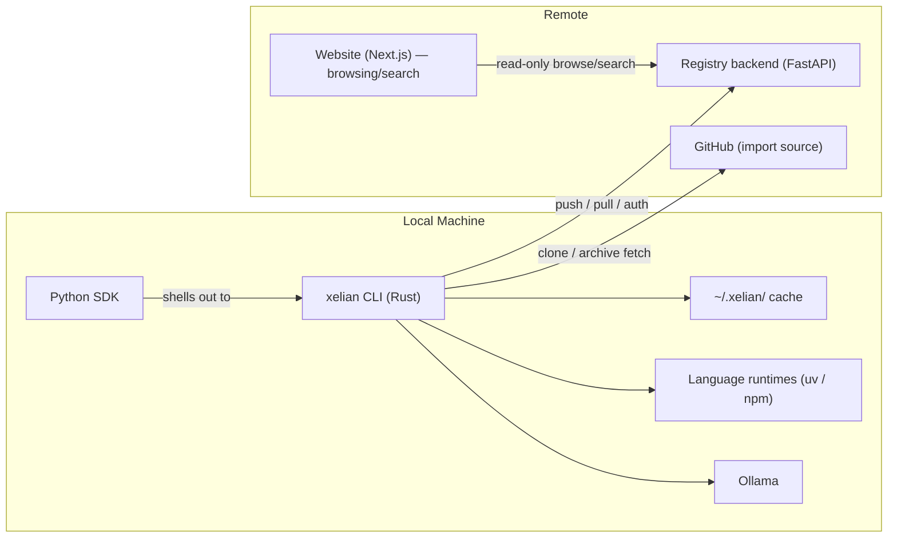
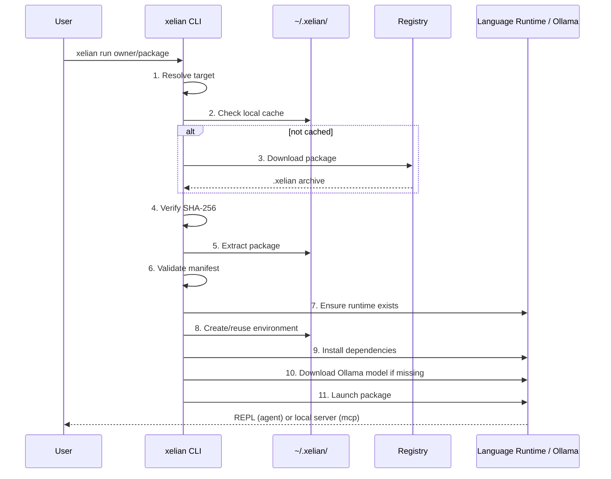
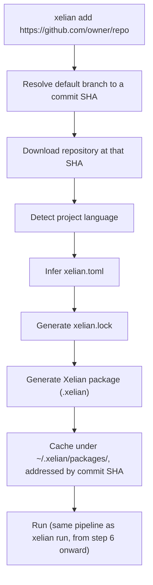

# Xelian Technical Specification

> Xelian is a local-first registry and runtime for AI agents and MCP servers.

---

## Table of Contents

1. [Introduction](#1-introduction)
2. [Conventions and Terminology](#2-conventions-and-terminology)
3. [Glossary](#3-glossary)
4. [System Overview](#4-system-overview)
5. [The Xelian Package Format (`.xelian`)](#5-the-xelian-package-format-xelian)
6. [The `xelian.toml` Manifest](#6-the-xeliantoml-manifest)
7. [The `xelian.lock` Lockfile](#7-the-xelianlock-lockfile)
8. [Package Validation (`xelian push`)](#8-package-validation-xelian-push)
9. [Runtime Execution (`xelian run`)](#9-runtime-execution-xelian-run)
10. [Language Runtime Management](#10-language-runtime-management)
11. [Local Cache Layout (`~/.xelian/`)](#11-local-cache-layout-xelian)
12. [GitHub Import (`xelian add`)](#12-github-import-xelian-add)
13. [CLI Command Reference](#13-cli-command-reference)
14. [Registry](#14-registry)
15. [Python SDK](#15-python-sdk)
16. [Permissions](#16-permissions)
17. [Features](#17-features)
18. [Model Management (Ollama)](#18-model-management-ollama)
19. [Versioning, Immutability, and Naming](#19-versioning-immutability-and-naming)
20. [Security Considerations](#20-security-considerations)
21. [Design Invariants](#21-design-invariants)
22. [Out of Scope for V1](#22-out-of-scope-for-v1)
23. [Future Work](#23-future-work)
24. [Appendix A: Rationale](#appendix-a-rationale)
25. [Appendix B: Full `xelian.toml` Reference Table](#appendix-b-full-xeliantoml-reference-table)
26. [Appendix C: End-to-End Walkthrough](#appendix-c-end-to-end-walkthrough)
27. [Appendix D: Open TODOs](#appendix-d-open-todos)

---

## 1. Introduction

### 1.1 Purpose

Xelian defines a standard package format and local-first runtime for AI agents and
MCP (Model Context Protocol) servers. Its objective is to make running an agent feel
identical to running a model with Ollama:

```bash
xelian run owner/package
```

downloads, verifies, installs, and launches the package with zero additional setup
from the user. This document specifies:

- the on-disk package format (`.xelian`)
- the manifest and lockfile schemas (`xelian.toml`, `xelian.lock`)
- the validation pipeline executed by `xelian push`
- the resolution, verification, and execution pipeline executed by `xelian run`
- the local cache layout
- the GitHub import mechanism
- the CLI command surface
- the registry's responsibilities and protocol, including package lifecycle
  management (publish, update, yank)
- the Python SDK's responsibilities
- security, permissions, and versioning rules

### 1.2 Non-Goals

Xelian is **not**:

- a workflow orchestration engine
- a container runtime (Docker, OCI) replacement
- a cluster scheduler (Kubernetes) replacement
- an agent framework (it runs agents; it does not define how agents are built
  internally)
- a hosted execution platform (V1 is local-first only)

Its sole architectural contribution is a **standard package format and runtime**
for locally executable agents and MCP servers, analogous to what GGUF is for model
weights.

### 1.3 Design Principles

These principles govern every normative decision in this document. Where a
requirement appears to conflict with one of these principles, the principle wins
unless this document explicitly states otherwise.

- **Local-first.** No cloud dependency is required for execution.
- **Single static binary.** The `xelian` CLI ships as one executable with minimal
  runtime dependencies.
- **Convention over configuration.** Sensible defaults are preferred over
  configuration files.
- **Batteries included.** Install → run → chat should take minutes, not hours.
- **Simplicity over feature completeness.** The smallest implementation that
  proves the core idea is preferred.
- **Language agnostic package format.** One format, many implementation
  languages.
- **Native package managers remain the source of truth.** Xelian does not
  reinvent `pip`, `uv`, or `npm`.
- **Xelian abstracts runtime differences**, not application logic.
- **GitHub is an import source, not the canonical registry.**

### 1.4 Relationship to Prior Art

Xelian's design is deliberately derivative of well-understood systems, and this
specification borrows their vocabulary where useful:

| Concept | Prior art analog |
|---|---|
| `.xelian` package | OCI image / Cargo crate / npm tarball |
| `xelian.toml` | `Cargo.toml` / `package.json` / `pyproject.toml` |
| `xelian.lock` | `Cargo.lock` / `package-lock.json` |
| `xelian run owner/name` | `ollama run llama3` |
| `xelian push` | `cargo publish` / `npm publish` |
| Registry | crates.io / npm registry / Docker Hub (distribution only, no compute) |
| `xelian yank` | `cargo yank` |
| `xelian login` | `gh auth login` / `docker login` |
| Python version constraints | [PEP 440](https://peps.python.org/pep-0440/) |
| Node version constraints | [SemVer ranges](https://semver.org) |
| MCP transport | [Model Context Protocol specification](https://modelcontextprotocol.io) |

---

## 2. Conventions and Terminology

The key words **MUST**, **MUST NOT**, **REQUIRED**, **SHALL**, **SHALL NOT**,
**SHOULD**, **SHOULD NOT**, **RECOMMENDED**, **MAY**, and **OPTIONAL** in this
document are to be interpreted as described in RFC 2119.

Sections and callouts are marked as follows:

> **Rationale:** Explains *why* a rule exists. Rationale blocks are
> **non-normative** — they exist to aid implementers and reviewers, and impose no
> requirements themselves.

> **TODO-N:** Marks a point where the design record does not specify enough
> detail to write a normative rule. Implementers MUST NOT treat illustrative
> examples near an open TODO as normative until the TODO is resolved. All open
> TODOs are indexed in [Appendix D](#appendix-d-open-todos).

Code blocks labeled `toml`, `bash`, or `text` are illustrative unless the
surrounding prose explicitly says otherwise.

---

## 3. Glossary

| Term | Definition |
|---|---|
| **Package** | A `.xelian` archive: the canonical, immutable unit of distribution in Xelian. |
| **Agent** | A `package-type` whose entrypoint, when launched, exposes an interactive conversational REPL. |
| **MCP server** | A `package-type` whose entrypoint, when launched, exposes a Model Context Protocol server locally. |
| **Manifest** | `xelian.toml`, the declarative description of a package. |
| **Lockfile** | `xelian.lock`, Xelian-generated metadata for reproducibility and validation. |
| **Registry** | The service that stores and serves published packages. It never executes code. |
| **Runtime** (language runtime) | An underlying language execution environment (e.g., a specific Python or Node.js version), managed by Xelian via `uv` or `npm`. |
| **Runtime** (Xelian runtime) | The `xelian run` execution pipeline as a whole. Context disambiguates usage. |
| **Environment** | An isolated, cached installation of a package's dependencies for a specific package version. |
| **Import** | Converting a non-Xelian source (a GitHub repository) into a Xelian package via `xelian add`. |
| **Publish** | Uploading a validated `.xelian` package to the registry via `xelian push`. |
| **Yank** | Marking a published version as unavailable for new resolution without deleting its archive. See [§14.7](#147-deletion-semantics-yank). |
| **Owner** | The registry account authorized to publish, yank, and manage a given package namespace. |
| **Cache** | The `~/.xelian/` directory tree holding downloaded packages, runtimes, environments, and models. |

---

## 4. System Overview

Xelian consists of four independently deployable components:



The central invariant of this architecture is: **the runtime never executes
arbitrary repositories or arbitrary registry content directly.** Every execution
path — a local folder, a GitHub repository, or a registry download — is first
converted into a `.xelian` package (in memory or on disk) before `xelian run`
touches it.

```text
Local folder            GitHub repository           Registry download
     |                          |                            |
     v                          v                            v
   xelian init/push      xelian add <url>              xelian run owner/name
     |                          |                            |
     +----------> Xelian package (.xelian) <-----------------+
                          |
                          v
                    xelian run pipeline
                    (validate, install, launch)
```

---

## 5. The Xelian Package Format (`.xelian`)

### 5.1 File Extension and Container Format

A Xelian package file MUST use the extension `.xelian`. Internally, a `.xelian`
file MUST be a `gzip`-compressed `tar` archive (`tar.gz`), so that any standard
`tar` implementation can inspect a package with:

```bash
tar -tzf mypackage.xelian
```

> **Rationale:** Reusing `tar.gz` instead of inventing a new container format
> keeps the format inspectable with universally available tooling, consistent
> with the "simplicity over features" principle.

### 5.2 Archive Layout

A conforming `.xelian` archive root MUST contain:

```text
mypackage.xelian
├── xelian.toml          # REQUIRED — manifest
├── xelian.lock          # REQUIRED — lockfile
├── README.md            # REQUIRED
├── LICENSE              # REQUIRED
├── src/                 # OPTIONAL — package source
├── assets/              # OPTIONAL
├── docs/                # OPTIONAL — additional documentation
├── examples/            # OPTIONAL
└── tests/               # OPTIONAL
```

The names `src/`, `assets/`, `docs/`, `examples/`, and `tests/` are conventional,
not mechanically enforced directory names; the manifest's `entrypoint` field
(§6.1) is the authoritative pointer to executable code and MAY reference paths
outside these conventional directories.

### 5.3 Required Files

| File | Requirement |
|---|---|
| `xelian.toml` | MUST be present at archive root. See §6. |
| `xelian.lock` | MUST be present at archive root. See §7. |
| `README.md` | MUST be present at archive root. Rendered on the registry package page. |
| `LICENSE` | MUST be present at archive root. Full license text, not just an SPDX identifier. |

`xelian push` MUST fail validation ([§8](#8-package-validation-xelian-push)) if
any required file is absent.

### 5.4 Exclusion Rules

Xelian packaging MUST respect `.gitignore` semantics: any file or directory that
would be excluded by the project's `.gitignore` (evaluated the same way `git`
evaluates it) MUST NOT be included in the built `.xelian` archive, even if it
exists on disk at packaging time.

> **Rationale:** This prevents accidental leakage of secrets, virtual
> environments, `node_modules/`, build artifacts, and local caches into a
> published, immutable package.

In addition, regardless of `.gitignore` contents, Xelian MUST always exclude:

- version control metadata (`.git/`)
- the `xelian.lock`-adjacent build scratch directory Xelian itself uses, if any

Xelian MUST NOT provide a mechanism to force-include a `.gitignore`-excluded file
into a package in V1.

If the file or path referenced by `entrypoint` (§6.1) is itself excluded by
`.gitignore`, `xelian push` MUST fail validation (§8) and packaging MUST stop —
this produces a package that could never run, which the validation pipeline
exists to prevent.

### 5.5 Package Types

Xelian V1 defines exactly two package types, declared via the manifest's
`package-type` field:

| `package-type` | Runtime behavior on `xelian run` |
|---|---|
| `agent` | Entrypoint is launched attached to an interactive terminal REPL. |
| `mcp` | Entrypoint is launched as a Model Context Protocol server exposed locally. |

Package type MUST NOT affect archive structure, manifest requirements (beyond
type-conditional fields noted in §6), or the validation pipeline. Package type
**only** affects step 11 of the `xelian run` pipeline (§9.10, "Launch").

> **Rationale:** "One format, multiple types" is a foundational invariant
> (§21). Introducing type-specific archive layouts would fragment the format
> and violate this invariant.

---

## 6. The `xelian.toml` Manifest

`xelian.toml` is a [TOML](https://toml.io) file describing how Xelian installs,
validates, and executes a package. It is the Xelian analog of `Cargo.toml` /
`package.json`.

### 6.1 Required Fields

| Field | Type | Description |
|---|---|---|
| `spec-version` | integer | The Package Format Specification version this manifest conforms to. Currently `1` (this document). Xelian MUST reject manifests declaring a `spec-version` it does not implement. |
| `name` | string | Package name. MUST match the naming rules in §19.3. |
| `version` | string | SemVer 2.0.0 version string. See §19.1. |
| `description` | string | Single-line human-readable summary. |
| `package-type` | string enum: `"agent"` \| `"mcp"` | See §5.5. |
| `language` | string enum: `"python"` \| `"node"` | Determines which runtime manager (§10) Xelian invokes. |
| `runtime` | string | Version constraint for the language runtime, in the **native ecosystem's own syntax**: [PEP 440](https://peps.python.org/pep-0440/) for `language = "python"` (e.g. `">=3.11,<4"`), a SemVer range for `language = "node"` (e.g. `">=22"`). Xelian MUST NOT invent a Xelian-specific constraint syntax and MUST delegate parsing/matching to the native runtime manager (`uv` or `npm`). |
| `entrypoint` | string | Path (relative to archive root) or command Xelian invokes to launch the package. |
| `author` | table | Author identity, matched against the registry account on publish. See §6.1.1. |
| `license` | string | SPDX license identifier (e.g. `MIT`, `Apache-2.0`). |
| `dependencies` | table | Pointer to the package's native dependency manifest and lockfile. See §6.1.2. MUST NOT re-declare individual dependency versions already present in the native manifest — native managers remain authoritative. |
| `permissions` | array of strings | Declared permission scopes, drawn from the closed enum in §16.1. Xelian MUST reject a manifest declaring a value outside that enum. |
| `features` | array of strings | Declared capability tags, drawn from the closed list in §17. |

#### 6.1.1 Author Shape

```toml
[author]
name = "Jane Doe"
email = "jane@example.com"
homepage = "https://example.com"    # OPTIONAL
```

`name` and `email` MUST be present. `homepage` MAY be present.

#### 6.1.2 Dependencies Shape

```toml
[dependencies]
manifest = "pyproject.toml"
lockfile = "uv.lock"
```

or, for a Node package:

```toml
[dependencies]
manifest = "package.json"
lockfile = "package-lock.json"
```

`manifest` MUST be present and MUST be a path, relative to the archive root, to
the package's native dependency manifest. `lockfile` SHOULD be present when the
native ecosystem produces one. Xelian MUST delegate all dependency resolution
and installation to the native package manager operating on these files (§9.8)
— `dependencies` is a pointer, never a redeclaration.

### 6.2 Optional Fields

| Field | Type | Description |
|---|---|---|
| `os` | array of strings | Restricts supported operating systems, e.g. `["linux", "macos", "windows"]`. Absence means no restriction. Enforced per §9.6.1. |
| `homepage` | string (URL) | Project homepage. |
| `repository` | string (URL) | Source repository URL. |
| `documentation` | string (URL) | External documentation URL. |
| `port` | integer | Preferred local port. Primarily meaningful for `package-type = "mcp"`. See §9.10.2. |
| `primary-model` | string | Preferred Ollama model identifier (e.g. `"llama3"`). See §18. |
| `environment` | table | Declared environment variables the package consumes, each with `required` and/or `default`. See §6.2.1. |
| `commands` | table | Named auxiliary commands (e.g. `test`, `lint`, `build`). See §6.2.2. |
| `tags` | array of strings | Free-form registry browse/search tags. |

> **Note:** `api-keys-required` was considered and removed from the manifest
> schema. Any environment variable a package needs — including third-party API
> keys — MUST be declared via `[environment]` (§6.2.1) instead; a dedicated
> field for API keys specifically would have duplicated that mechanism.

#### 6.2.1 Environment Variables

```toml
[environment]
OPENAI_API_KEY = { required = true }
DEBUG = { default = "false" }
```

Each key is an environment variable name; its value is a table with:

- `required` (boolean, default `false`) — if `true`, Xelian MUST verify the
  variable is present in the process environment immediately before launch
  (§9.10) and MUST abort with a clear error, without launching the entrypoint,
  if it is missing.
- `default` (string, optional) — if `required` is not `true` and the variable
  is unset in the process environment, Xelian MUST populate it with this value
  before launch.

A variable MUST NOT declare both `required = true` and `default` — a required
variable, by definition, has no default.

#### 6.2.2 Commands

```toml
[commands]
test = "pytest"
lint = "ruff check"
build = "python build.py"
```

Command names are free-form strings. Xelian MUST NOT assign special runtime
meaning to any name in this table, including `test` — the only Xelian
behavior tied to `[commands]` is the syntactic presence check in §8.1 step 5.
Execution of any declared command is left entirely to the package author or
external tooling; Xelian MUST NOT execute a declared command at any point in
the validation (§8) or run (§9) pipelines.

### 6.3 The `[config]` Section

Application-specific configuration that Xelian does not need to understand MUST
live under a `[config]` table:

```toml
[config]
max_tokens = 4096
system_prompt_file = "prompts/system.md"
```

Xelian MUST treat the contents of `[config]` as an opaque blob: it MUST NOT
validate, interpret, or act on any key inside `[config]`. The package's own
runtime code is solely responsible for reading and interpreting `[config]`.

> **Rationale:** This is the manifest's escape hatch. It lets package authors
> carry arbitrary structured configuration without requiring changes to this
> specification or to the `xelian` binary.

### 6.4 Full Illustrative Example

```toml
spec-version = 1
name = "research_assistant"
version = "1.2.0"
description = "An agent that searches papers and summarizes findings."
package-type = "agent"
language = "python"
runtime = "python>=3.11,<4"
entrypoint = "src/main.py"
license = "MIT"
permissions = ["network", "filesystem"]
features = ["tools", "streaming"]

[author]
name = "Jane Doe"
email = "jane@example.com"
homepage = "https://example.com"

[dependencies]
manifest = "pyproject.toml"
lockfile = "uv.lock"

homepage = "https://example.com/research-assistant"
repository = "https://github.com/janedoe/research-assistant"
primary-model = "llama3"
tags = ["research", "search", "summarization"]

[environment]
SERPAPI_KEY = { required = true }
DEBUG = { default = "false" }

[commands]
test = "pytest"
lint = "ruff check"

[config]
max_tokens = 4096
```

See [Appendix B](#appendix-b-full-xeliantoml-reference-table) for the complete
field reference table.

---

## 7. The `xelian.lock` Lockfile

### 7.1 Purpose

`xelian.lock` is generated by Xelian, never hand-authored, and records the
metadata required to reproduce and validate a specific built package. It is the
Xelian analog of `Cargo.lock`, scoped to Xelian-level metadata only.

Xelian MUST NOT use `xelian.lock` to replace, shadow, or duplicate a native
lockfile (`uv.lock`, `package-lock.json`, etc). Native lockfiles remain
authoritative for dependency resolution; `xelian.lock` records a checksum *of*
the native lockfile for integrity verification, not its contents.

### 7.2 Contents and Format

`xelian.lock` MUST contain the following top-level keys:

| Key | Description |
|---|---|
| `spec-version` | The Package Format Specification version this package conforms to. |
| `xelian-version` | The version of the `xelian` binary that produced this lockfile. |
| `package-version` | The package's own SemVer version, copied from `xelian.toml`'s `version` field. |
| `generated-at` | ISO 8601 UTC timestamp of lockfile generation. |
| `native-manifest` | The path (copied from `dependencies.manifest`, §6.1.2) to the native dependency manifest. |
| `native-lockfile` | The path (copied from `dependencies.lockfile`, §6.1.2), if present. |
| `native-lock-checksum` | SHA-256 of the native lockfile's contents, if `native-lockfile` is present. |
| `package-checksum` | SHA-256 of the built `.xelian` archive. See §7.3. |

```toml
spec-version = 1
xelian-version = "0.4.2"
package-version = "1.2.0"
generated-at = "2026-07-16T10:00:00Z"

native-manifest = "pyproject.toml"
native-lockfile = "uv.lock"

native-lock-checksum = "sha256:2f1e...9ab3"
package-checksum = "sha256:9c4b...1e02"
```

### 7.3 Generation and Checksum Rules

- `xelian push` MUST generate or regenerate `xelian.lock` as part of the
  packaging pipeline (§8).
- Xelian MUST generate a SHA-256 checksum of the package archive
  (`package-checksum`) and, if a native lockfile is declared, a separate
  SHA-256 checksum of that native lockfile's contents (`native-lock-checksum`).
- `package-checksum` MUST be computed over the final archive contents
  **excluding `xelian.lock` itself**, to avoid a circular hash dependency.
  Xelian MUST NOT compute or store a checksum of `xelian.lock` itself.
- Consumers (i.e., `xelian run`) MUST verify `package-checksum` against the
  downloaded archive before extraction (§9.4).

---

## 8. Package Validation (`xelian push`)

### 8.1 Validation Pipeline

`xelian push` MUST perform the following steps, in order, before any network
upload occurs:

1. Parse and validate `xelian.toml` against the schema in §6 — including
   rejecting `permissions` values outside the closed enum in §16.1 and, if
   `os` is present, rejecting unrecognized OS identifiers. Missing required
   fields or an unsupported `spec-version` MUST fail validation.
2. Validate `xelian.lock` if one already exists on disk (i.e., re-validate
   before regenerating).
3. Verify all required files exist (§5.3).
4. Verify the file or command referenced by `entrypoint` exists at the declared
   path, and is not excluded by `.gitignore` (§5.4).
5. If `[commands]` (§6.2.2) is present, verify each value is a non-empty
   string. Xelian MUST NOT verify that a declared command's underlying tool is
   installed or resolvable, and MUST NOT execute any declared command.
6. Compute the SHA-256 package checksum (§7.3).
7. Generate or update `xelian.lock`.
8. Build the final `.xelian` archive (`tar.gz`), applying the exclusion rules
   of §5.4.

If any step fails, packaging MUST stop immediately and `xelian push` MUST exit
with a non-zero status without contacting the registry.

### 8.2 Failure Semantics

Validation failure is **fail-fast**: Xelian MUST NOT attempt to "partially"
package or upload a package that fails any step in §8.1. There is no partial or
draft publish state in V1.

### 8.3 Checksum Generation

The package checksum MUST be SHA-256, MUST be recorded in `xelian.lock`
(§7.2), and MUST be independently re-verified by every downloader in the
`xelian run` pipeline (§9.4). Xelian MUST NOT support alternative or
configurable checksum algorithms in V1.

### 8.4 No Arbitrary Code Execution During Validation

Xelian MUST NOT execute any application code belonging to the package being
validated — including any declared `[commands]` entry — during `xelian push`.
Validation is limited to static checks: file existence, manifest schema
conformance, and checksum computation.

> **Rationale:** `xelian push` runs on the package author's machine, but a
> future hosted validation step (e.g., a registry-side re-validation) cannot
> safely execute arbitrary uploaded code. Keeping validation purely static from
> V1 onward avoids building a sandboxing requirement into the critical path,
> and avoids an inconsistency where local validation behaves differently from
> any future server-side validation. This also resolves an apparent tension in
> the original design intent ("verify tests if present" vs. "MUST NOT execute
> arbitrary application code"): "verify" is read as *presence-check*, not
> *run* — §8.1 step 5 checks that a declared `test` command is a well-formed
> string, nothing more.

---

## 9. Runtime Execution (`xelian run`)

### 9.1 Pipeline Overview

`xelian run <target>` MUST execute the following steps in order:



1. **Resolve target** (§9.2)
2. **Check local cache** (§9.3)
3. **Download if missing** (§9.3)
4. **Verify SHA-256 checksum** (§9.4)
5. **Extract package** (§9.5)
6. **Validate manifest** (§9.6)
7. **Ensure runtime exists** (§9.7, §10)
8. **Create or reuse isolated environment** (§9.8)
9. **Install dependencies** (§9.8)
10. **Download required Ollama model if missing** (§9.9, §18)
11. **Launch package** (§9.10)

### 9.2 Target Resolution

`xelian run` MUST accept exactly two target forms:

| Form | Example | Resolution |
|---|---|---|
| Registry reference | `owner/package` | Resolved against the registry (§14) to the current latest stable, non-yanked, non-pre-release version. |
| GitHub URL | `https://github.com/owner/repo` | Resolved via the GitHub import pipeline (§12) — the repository is converted into a Xelian package before execution. |

Xelian MUST distinguish these forms syntactically (e.g., presence of a URL
scheme and `github.com` host) before attempting resolution. Any other input
form is invalid and Xelian MUST exit with an error rather than guessing.

**V1 does not support version pinning.** `xelian run owner/package` always
resolves to the highest SemVer version that is currently published, not
yanked, and not a pre-release (§19.1). There is no `owner/package@version`
syntax in V1; explicit version selection via `xelian run` is deferred to a
future release (§23).

### 9.3 Cache Check and Download

Xelian MUST check `~/.xelian/packages/` (§11) for a cached copy of the
resolved, exact version before making any network request. If present, Xelian
MUST skip the download step entirely and proceed to §9.4 using the cached
archive.

If absent, Xelian MUST download the `.xelian` archive from the registry.

### 9.4 Checksum Verification

Before extraction, Xelian MUST recompute the SHA-256 of the downloaded (or
cached) archive and compare it against the `package-checksum` recorded in the
package's `xelian.lock` (as served by the registry alongside the archive). On
mismatch, Xelian MUST abort and MUST NOT extract or execute the archive.

> **Rationale:** This is Xelian's primary integrity guarantee in V1, in the
> absence of package signing (§20.2, out of scope for V1).

### 9.5 Extraction

Xelian MUST extract the verified archive into a package-and-version-scoped
directory under `~/.xelian/packages/` (§11.1). Extraction MUST NOT overwrite an
existing extracted copy of the same package **version** — since packages are
immutable (§19.2), a matching version already on disk is assumed identical and
extraction MAY be skipped as an optimization.

### 9.6 Manifest Validation

Xelian MUST re-parse and re-validate `xelian.toml` from the extracted package
using the same schema rules as §8.1 step 1, and MUST verify the `spec-version`
is one this `xelian` binary implements. This is a defense-in-depth check: a
package that passed validation at publish time is still re-validated at run
time, since the binary performing `xelian run` may be a different (older or
newer) version than the one that ran `xelian push`.

#### 9.6.1 OS Compatibility Check

If the manifest declares `os` (§6.2) and the current operating system is not
in that list, Xelian MUST fail immediately with a clear error identifying the
unsupported OS and MUST NOT proceed to any further pipeline step (§9.7
onward) or attempt execution.

### 9.7 Runtime Existence Check

Based on the manifest's `language` field, Xelian MUST ensure the corresponding
language runtime manager is available (§10):

- `language = "python"` → ensure `uv` is available; use it to install and
  select a CPython version satisfying the `runtime` field's PEP 440 constraint
  (§6.1).
- `language = "node"` → ensure a Node.js runtime satisfying the `runtime`
  field's SemVer range is available, managed via `npm`.

If the runtime manager itself is missing, Xelian MUST install it automatically
without requiring manual user action (§10).

### 9.8 Environment Creation and Dependency Installation

Xelian MUST create or reuse exactly one isolated environment per
`(package name, version)` pair, cached under `~/.xelian/envs/` (§11.1), and
MUST reuse it across every subsequent launch of that same package version
rather than rebuilding it. The environment cache key MUST be the
`(name, version)` pair alone — Xelian MUST NOT compute or key environment
reuse on a hash of resolved dependencies in V1.

> **Rationale:** Since packages are immutable (§19.2), `(name, version)` alone
> is already a stable, unambiguous cache key — the package's declared
> dependencies for that version cannot change after publish. Hashing
> dependency contents as an additional cache key would be redundant
> complexity. This is a distinct concern from the `native-lock-checksum` in
> `xelian.lock` (§7.2), which exists for publish-time integrity, not
> run-time environment cache invalidation.

Dependency installation MUST be delegated to the native package manager
referenced by the manifest's `dependencies` pointer (§6.1.2) — `uv` for
Python, `npm` for Node — operating against the package's native manifest and
lockfile.

### 9.9 Model Management

If the manifest declares `primary-model` (§6.2) and the model is not already
present in `~/.xelian/models/` (§11.1) or in Ollama's own store, Xelian MUST
download it before launch (§18). If the Ollama binary/daemon itself is not
present on the system, Xelian MUST install it automatically before attempting
any model download — consistent with the "users never manually install
runtimes" requirement in §10.3.

### 9.10 Launch

Immediately before launching the entrypoint, Xelian MUST validate any
`required = true` entries in `[environment]` (§6.2.1) are present in the
process environment, applying declared `default` values where applicable, and
MUST abort with a clear error — without launching the entrypoint — if a
required variable is missing.

Xelian MUST then launch the package's `entrypoint` using the environment
created in §9.8. Launch behavior is conditional on `package-type` (§5.5):

#### 9.10.1 `package-type = "agent"`

Xelian MUST attach the entrypoint process's stdin/stdout/stderr to the user's
terminal, producing an interactive conversational REPL. `xelian run` MUST block
for the duration of the interactive session.

#### 9.10.2 `package-type = "mcp"`

Xelian MUST launch the entrypoint as a server process and expose it locally.

**Transport:** the default MCP transport is **stdio**, per the official
[Model Context Protocol specification](https://modelcontextprotocol.io).
Xelian MAY support additional transports (HTTP/SSE, WebSocket) in a future
release (§23); V1 implementations MUST support stdio.

**Port allocation:** if the manifest declares `port` (§6.2), Xelian MUST
attempt to bind that port first. If the requested port is unavailable, Xelian
MUST automatically select a free port instead and MUST inform the user which
port was actually selected. This allows multiple MCP servers to run
simultaneously without manual port coordination.

### 9.11 Cache Persistence

Downloaded and extracted packages, created environments, and downloaded models
MUST remain cached indefinitely until explicitly removed via `xelian rm`
(§13.6). `xelian run` MUST NOT perform implicit cache eviction.

---

## 10. Language Runtime Management

### 10.1 Python

Python runtime management MUST be delegated to [`uv`](https://github.com/astral-sh/uv).
Xelian MUST install `uv` automatically if it is not already present on the
user's system, and MUST use it to install and manage the CPython version
required by a package's `runtime` constraint (§6.1).

### 10.2 Node.js

Node.js runtime management MUST be delegated to `npm`. Xelian MUST install the
official Node.js runtime automatically if not already present, and MUST
manage packages for the installed runtime using `npm`.

### 10.3 User Experience Requirement

Users MUST NOT be required to manually install Python or Node.js to run any
Xelian package, regardless of the package's implementation language. This is a
hard requirement derived directly from the "batteries included" design
principle (§1.3) and is load-bearing for the "Ollama feel" success criterion.

### 10.4 Future Runtimes

Additional `language` values (e.g., Rust, Go) are explicitly out of scope for
V1 (§22) but the `language` → runtime-manager mapping in §10.1–10.2 MUST be
implemented as an extensible dispatch (not hardcoded to exactly two branches
in a way that would require a rewrite to add a third), so that future language
support does not require redesigning this section.

---

## 11. Local Cache Layout (`~/.xelian/`)

### 11.1 Directory Structure

```text
~/.xelian/
├── packages/           # Downloaded/extracted .xelian packages: packages/<owner>/<name>/<version>/
├── runtimes/            # Managed language runtimes (Python via uv, Node via npm)
├── envs/                # Isolated per-package-version environments: envs/<owner>/<name>/<version>/
├── models/               # Downloaded Ollama models: models/<model-name>/
├── logs/                  # Xelian CLI operation logs
├── tmp/                    # Scratch space for in-progress downloads/extraction
└── credentials.toml        # Registry authentication token(s) — see §14.4. MUST be created with 0600 permissions.
```

`packages/`, `envs/`, and `models/` MUST each address their contents uniquely
by `(owner, name, version)` (or, for `models/`, by model identifier) so that a
cached artifact can always be located without ambiguity.

### 11.2 Retention

Nothing under `~/.xelian/` is time-limited or automatically evicted in V1.
Removal is exclusively user-initiated via `xelian rm` (§13.6).

### 11.3 Scope and Credential Isolation

`~/.xelian/` is local cache state, not registry state. Deleting the cache
subdirectories (`packages/`, `envs/`, `runtimes/`, `models/`) MUST have no
effect on anything published to the registry.

`credentials.toml` MUST NOT live inside `packages/`, `envs/`, `runtimes/`, or
`models/` — it is a top-level file in `~/.xelian/`, kept separate from the
cache subdirectories so that clearing the cache does not silently sign the
user out. `xelian rm --all` (§13.6) MUST NOT delete `credentials.toml`.

---

## 12. GitHub Import (`xelian add`)

### 12.1 Purpose

GitHub repositories are an **import source**, not the canonical registry
(§1.3, §21). `xelian add <github-url>` converts a repository into a Xelian
package, caches it, and runs it — without requiring an explicit publish step.

### 12.2 Workflow



1. Resolve the repository's default branch to a specific commit SHA, and
   download the repository at that SHA. Xelian MUST cache and address the
   resulting package **by commit SHA, not by branch name**, to ensure
   reproducible re-imports.
2. Detect the project's language, in the following order of precedence:
   1. `pyproject.toml` present → `language = "python"`
   2. `package.json` present → `language = "node"`
   3. `Cargo.toml` present → an as-yet-unsupported language (Rust). Xelian
      MUST fail with a clear "unsupported language" error rather than
      attempting import, since no `language = "rust"` runtime manager exists
      in V1 (§22).

   This detection order is extensible: future languages are added by
   appending additional manifest-file checks, not by redesigning the
   precedence mechanism.
3. Infer a `xelian.toml` manifest from repository conventions. Xelian MUST
   infer `language`, `runtime`, `entrypoint`, and `dependencies` from the
   detected project structure. Every other required or optional field (§6.1,
   §6.2) that cannot be mechanically derived MUST receive a placeholder value
   for the user to edit before publishing — `xelian add` MUST NOT fail merely
   because non-inferable fields are placeholders, since imported packages are
   local-only until an explicit `xelian push` (§12.3), at which point normal
   validation (§8) applies and MUST reject any field still holding an invalid
   placeholder.
4. Generate a `xelian.lock` (§7).
5. Generate the `.xelian` package internally (same archive format as §5).
6. Cache it under `~/.xelian/packages/` (§11.1), addressed by commit SHA.
7. Run it through the same execution pipeline as `xelian run` (§9), starting
   from manifest validation (§9.6) onward.

### 12.3 Relationship to `xelian push`

`xelian add` MUST NOT publish anything to the registry. The package it
generates is local-only cache state. Publishing an imported package to the
registry still requires an explicit, separate `xelian push` — imported and
locally-generated packages are not implicitly promoted to public packages.

> **Rationale:** This preserves "GitHub is an import source, not the canonical
> registry" (§21) — import and publish are and must remain distinct actions
> with distinct user intent.

---

## 13. CLI Command Reference

The CLI surface below matches the commands enumerated in the design record,
plus `xelian login`/`xelian logout`/`xelian yank`, added to satisfy the
requirement that package owners be able to authenticate, publish, and remove
their own packages (§14.4–§14.7).

### 13.1 `xelian init`

Creates a new package skeleton in the current directory: `xelian.toml` and
`xelian.lock`.

```bash
xelian init
```

`xelian init` MUST NOT contact the network or the registry.

### 13.2 `xelian push`

Validates (§8) and publishes the current package to the registry. Requires
authentication (§14.4).

```bash
xelian push
```

`xelian push` MUST perform the full validation pipeline (§8.1) before any
network activity, and MUST reject republishing an already-published
`(name, version)` pair (§19.2).

### 13.3 `xelian run`

Downloads (if necessary) and executes a package. See §9.

```bash
xelian run owner/package
xelian run https://github.com/owner/repo
```

Version pinning (`owner/package@version`) is not part of V1 syntax — `xelian
run owner/package` always resolves to the latest stable, non-yanked version
(§9.2). See [Future Work](#23-future-work).

### 13.4 `xelian add`

Imports a GitHub repository as a local Xelian package and runs it. See §12.

```bash
xelian add https://github.com/owner/repo
```

### 13.5 `xelian list`

Lists **locally cached** packages. This is a local cache inspection command,
not a registry search command — CLI-driven registry search is explicitly out
of scope for V1 (§22).

```bash
xelian list
```

### 13.6 `xelian rm`

Removes cached package state from `~/.xelian/` (§11).

```bash
xelian rm owner/package              # remove the cached package only
xelian rm owner/package --env        # also remove its cached environment
xelian rm --all                      # remove everything under packages/, envs/, runtimes/, and models/
```

`xelian rm owner/package` (without `--env`) removes all locally cached
versions of that package but leaves its environment(s) under `~/.xelian/envs/`
intact for faster reinstallation if the package is run again. `xelian rm
--all` MUST NOT delete `credentials.toml` (§11.3).

`xelian rm` MUST only affect local cache state (§11) and MUST NOT affect the
registry's copy of the package.

### 13.7 `xelian login`

Authenticates the CLI against the registry via a browser-based OAuth flow
(similar to `gh auth login` / `docker login`) and stores the resulting
credential in `~/.xelian/credentials.toml` (§11.1, §14.4).

```bash
xelian login
```

### 13.8 `xelian logout`

Removes the stored credential from `~/.xelian/credentials.toml`.

```bash
xelian logout
```

### 13.9 `xelian yank`

Marks a published version as yanked (§14.7) or reverses that. Requires
authentication as the package's owner (§14.4). MUST NOT delete the underlying
archive.

```bash
xelian yank owner/package --version 1.2.0
xelian yank owner/package --version 1.2.0 --undo
```

> **Rationale:** `xelian yank` targets an explicit version via `--version`
> rather than a `owner/package@version` pin, since pin syntax is not part of
> V1 (§9.2, §13.3). Yanking is inherently version-specific regardless of
> whether `xelian run` supports pinning.

### 13.10 Command Summary Table

| Command | Network? | Auth required? | Mutates registry? | Mutates local cache? |
|---|---|---|---|---|
| `xelian init` | No | No | No | Yes (creates files in CWD, not cache) |
| `xelian push` | Yes | Yes | Yes (publish) | No |
| `xelian run` | Maybe (if not cached) | No | No | Yes (cache write) |
| `xelian add` | Yes | No | No | Yes (cache write) |
| `xelian list` | No | No | No | No (read-only) |
| `xelian rm` | No | No | No | Yes (cache delete) |
| `xelian login` | Yes | No (establishes it) | No | Yes (writes credentials) |
| `xelian logout` | No | No | No | Yes (deletes credentials) |
| `xelian yank` | Yes | Yes | Yes (marks version yanked) | No |

---

## 14. Registry

### 14.1 Responsibilities

The registry:

- stores package archives, metadata, README content, checksums, version
  history, and author information.
- serves packages by **exact name** lookup for CLI consumption.
- MUST NOT execute any package code, at any point, for any reason.

Browsing and discovery (search, category listing, etc.) is the website's
responsibility, not the registry API's or the CLI's. The CLI resolves exact
package names only; CLI-driven search is out of scope for V1 (§22).

### 14.2 Data Model

```text
Account
  ├── username (namespace-forming: matches "owner" in owner/name)
  └── credential(s)

Package (namespace = owner)
  ├── name
  └── Versions[]
        ├── version (SemVer)
        ├── archive (.xelian, immutable)
        ├── checksum (sha256)
        ├── xelian.lock (as published)
        ├── README (rendered from archive contents)
        ├── metadata (description, tags, permissions, features — read from xelian.toml)
        ├── published_at
        └── yanked: bool
```

### 14.3 Package Resolution

Given `owner/package`, the registry MUST resolve to the highest SemVer version
that is **not yanked** and **not a pre-release** (§19.1). If no such version
exists, resolution MUST fail with a clear error rather than silently falling
back to a yanked or pre-release version.

V1 provides no mechanism to resolve a specific, non-latest version through
`xelian run` — see §9.2 and [Future Work](#23-future-work).

### 14.4 Authentication and Authorization

Registry-mutating operations — `xelian push` and `xelian yank` — MUST require
an authenticated request identifying a registry account. The CLI obtains and
stores this credential via `xelian login` (§13.7), using a browser-based OAuth
flow.

Authorization rule: an account MAY publish or yank a package only if the
package's namespace (`owner` in `owner/name`) matches that account. V1
supports **single-owner packages only** — multi-owner/team namespaces are out
of scope (§22).

### 14.5 Publishing (Upload)

Publishing occurs exclusively via `xelian push` (§13.2) after full local
validation (§8). The registry SHOULD additionally verify, on receipt:

- the uploaded archive's SHA-256 matches `package-checksum` in the
  accompanying `xelian.lock`.
- `(name, version)` has not been previously published (§19.2).

The registry MUST NOT execute the uploaded package (§14.1).

### 14.6 Update Semantics

**There is no in-place update operation.** Any change to a package — including
changes limited to `README.md`, `description`, or `tags` — MUST be published
as a new SemVer version via `xelian push`. The registry MUST NOT expose any
API or CLI path that mutates the content or metadata of an already-published
version.

> **Rationale:** A package's displayed README, description, and tags are read
> directly from the immutable archive's `xelian.toml`/`README.md` (§14.2). If
> the registry allowed editing that metadata independently of the archive, the
> registry's displayed information could drift from what `xelian run` actually
> installs — silently breaking the trust relationship between "what you see on
> the package page" and "what you get." Requiring a new version for any
> change, including docs-only fixes, keeps exactly one source of truth per
> version.

### 14.7 Deletion Semantics: Yank

**Published package versions MUST NOT be hard-deleted via any self-service,
owner-facing CLI or API path in V1.** Instead, Xelian provides *yanking* as a
V1 feature.

#### 14.7.1 Yank Behavior

`xelian yank owner/package --version <version>` (§13.9), when authorized
(§14.4), MUST:

- mark that version as `yanked = true` in the registry's data model (§14.2).
- remove it from resolution (§14.3) — `xelian run owner/package` MUST skip
  yanked versions when selecting the highest version.
- **NOT** delete the archive, checksum, or metadata.
- **NOT** affect anyone who already has that version cached locally (§11.2).

`xelian yank owner/package --version <version> --undo` MUST reverse this: set
`yanked = false`.

Because V1 has no version-pinning mechanism for `xelian run` (§9.2, §23), a
yanked version cannot be intentionally re-fetched through `xelian run` once it
is no longer the resolved latest — it remains retrievable only via an
already-existing local cache (§11.2) or direct registry API access (§14.8).

> **Rationale:** This mirrors `cargo yank` precedent (§1.4). It satisfies the
> owner's need to "remove" a version — e.g., because it has a bug, leaks a
> secret pattern in an example, or should no longer be recommended to new
> users — while preserving the immutability invariant (§19.2, §21) for anyone
> already depending on it. Immutability exists specifically so that a
> published version always means the same bytes; a self-service hard delete
> would violate that for every existing dependent, which is a strictly worse
> failure mode than leaving a flagged, non-default version's bytes intact.

#### 14.7.2 Hard Delete (Administrative Only)

True, irreversible removal of a package archive from registry storage MUST NOT
be exposed as a self-service `xelian` CLI command or public registry API
endpoint in V1. It exists only as a registry-operator/administrative
capability (e.g., a manual operation performed by whoever runs the registry
infrastructure), reserved for legal takedown, security incidents (e.g.,
credential leakage in a published archive), or similar exceptional cases.

> **TODO-20:** The administrative hard-delete process itself (tooling, audit
> trail, whether `(name, version)` becomes permanently reserved/tombstoned
> after a hard delete to prevent a malicious re-publish reusing a trusted
> version number) remains unspecified. This is registry-operations tooling,
> not end-user-facing CLI surface, and is independent of §14.7.1's yank
> mechanism, which is fully specified and ships in V1.

### 14.8 Registry API

The following three routes are the ratified V1 baseline:

| Operation | Route |
|---|---|
| Publish new version | `POST /packages` |
| Fetch package metadata (latest version) | `GET /packages/{owner}/{package}` |
| Download a specific version's archive | `GET /download/{owner}/{package}/{version}` |

Registry-driven search is explicitly not part of this surface (§22). Exact
request/response schemas are left to implementation.

> **TODO-15:** Routes for `xelian yank`/`xelian login` (authentication and
> yank/unyank) are necessary (§13.7, §13.9) but not covered by the ratified
> baseline above; their exact shape remains open. An illustrative,
> non-normative sketch: `PATCH /packages/{owner}/{package}/{version}` for
> yank/unyank, and an OAuth token/callback route pair for `xelian login`.

### 14.9 Website

The website (Next.js, per the project's tech stack) consumes the registry API
read-only, for browsing and search. The website MUST NOT have any privileged
write access beyond what an authenticated account could also do via the CLI —
i.e., it is a client of the same registry API, not a separate control plane.

---

## 15. Python SDK

### 15.1 Responsibilities

The Python SDK wraps the `xelian` CLI (i.e., it MUST NOT reimplement
resolution, validation, or execution logic independently — it shells out to
`xelian`) and exposes a Python interface to:

- install packages
- execute packages
- communicate with running agents
- expose MCP servers to Python callers

> **Rationale:** "Wraps the CLI" is explicit in the source design. This keeps
> exactly one implementation of the runtime pipeline (§9) — the Rust binary —
> as the source of truth, avoiding drift between a Python-native
> reimplementation and the CLI.

### 15.2 API Surface

The SDK's initial API surface consists of four top-level functions:

```python
import xelian

xelian.install("owner/package")          # download + prepare, without launching
pkg = xelian.run("owner/research_assistant")     # generic: install (if needed) + launch
response = pkg.chat("Summarize the latest arXiv papers on MCP.")

agent = xelian.agent("owner/research_assistant")  # convenience wrapper: asserts package-type == "agent"
mcp = xelian.mcp("owner/some_mcp_server")         # convenience wrapper: asserts package-type == "mcp"
mcp.expose()  # makes the local MCP server available to an MCP client
```

- `xelian.install(target)` MUST perform pipeline steps 1–9 (§9.1) without
  launching (step 11) — it prepares a package for use without starting it.
- `xelian.run(target)` MUST perform the full pipeline (§9.1) and return a
  handle appropriate to the package's `package-type`.
- `xelian.agent(target)` and `xelian.mcp(target)` MUST behave identically to
  `xelian.run(target)`, except each MUST raise an error if the resolved
  package's `package-type` does not match (`agent`/`mcp` respectively).

> **TODO-29 (partially open):** Exact method names on the returned handle
> beyond `.chat()`/`.expose()`, sync vs. async, and streaming interface
> details remain open beyond the four top-level entry points above.

---

## 16. Permissions

### 16.1 Declaration

Packages declare requested permissions in `xelian.toml`'s `permissions` array
(§6.1), drawn from a **closed enum**:

```text
filesystem
network
camera
microphone
clipboard
location
notifications
```

Xelian MUST validate `permissions` values against this enum during validation
(§8.1 step 1) and MUST reject a manifest declaring any value outside it.

### 16.2 Runtime Prompting

Xelian MUST prompt the user to grant or deny each declared permission on the
**first run** of a given package version. Xelian SHOULD NOT re-prompt on
subsequent runs of a version the user has already granted permissions to.

In V1, declared permissions are **informational/disclosure-only**: Xelian
prompts the user and displays the request, but does not technically sandbox
or restrict the process's actual filesystem/network/device access. Technical
enforcement via sandboxing is future work (§23).

### 16.3 Registry Display

Declared permissions MUST be displayed on the package's registry/website page
so a user can evaluate a package before running it, independent of the
first-run prompt.

---

## 17. Features

Features are declarative capability tags in `xelian.toml`'s `features` array
(§6.1), used for registry display, drawn from a closed list:

```text
vision
voice
streaming
memory
tools
reasoning
multimodal
embeddings
```

Unlike `permissions`, features carry no runtime behavior in V1 and are purely
informational: Xelian MUST NOT alter execution based on declared features.
Because features have no security implications (unlike permissions, §16.1),
Xelian SHOULD (not MUST) warn on a manifest declaring a feature tag outside
this list, rather than failing validation outright. The registry/website MAY
use features for future filtering (§23), but CLI-driven filtering is out of
scope for V1 (§22).

---

## 18. Model Management (Ollama)

Packages MAY declare a `primary-model` (§6.2). If declared and not already
present locally, Xelian MUST download it automatically before launch, cache it
locally, and reuse it on future runs (§9.9).

Ollama is the sole supported model provider in V1. Xelian MUST NOT require
users to manually install or configure Ollama: if the Ollama binary/daemon
itself is not present on the system, Xelian MUST install it automatically
(§9.9), consistent with the "batteries included" requirement that applies
identically to Python/Node runtimes (§10.3).

Support for additional model providers beyond Ollama is future work (§23), not
V1 scope.

---

## 19. Versioning, Immutability, and Naming

### 19.1 Versioning

Package versions MUST conform to [Semantic Versioning 2.0.0](https://semver.org).

Resolution (§9.2, §14.3) MUST exclude pre-release versions (e.g.
`1.0.0-beta.1`) by default — the "latest" version is always the highest
non-pre-release, non-yanked SemVer version. Explicit opt-in resolution of
pre-release versions is future work, tied to version pinning (§23).

### 19.2 Immutability

Once published, a `(name, version)` pair's archive contents MUST NOT be
altered or overwritten. `xelian push` targeting an already-published version
MUST fail. This invariant is preserved even by the yank mechanism (§14.7),
which changes visibility/resolution, never archive bytes.

### 19.3 Naming

Package names MUST consist only of lowercase ASCII letters, digits, `_`
(underscore), and `-` (hyphen), and MUST be between 3 and 64 characters in
length, inclusive. Xelian MUST reject `xelian push` for a name that does not
conform.

```text
weather_agent
my-mcp
code_assistant
```

> **TODO (naming, residual):** Whether leading digits/hyphens/underscores are
> permitted, and whether any names are reserved to prevent squatting on
> well-known project names, remain unspecified.

---

## 20. Security Considerations

### 20.1 Integrity

All package downloads MUST be verified against a SHA-256 checksum before
extraction or execution (§9.4). This is Xelian's baseline integrity guarantee
in V1.

### 20.2 No Signing in V1

Cryptographic package signing (author identity verification beyond registry
account authentication) is explicitly out of scope for V1 (§22). Checksum
verification proves the downloaded bytes match what the registry served; it
does **not** prove the registry itself was not compromised, nor does it prove
authorial identity beyond the registry account that authenticated the publish.

### 20.3 Validation Isolation

Xelian MUST NOT execute package code during validation (`xelian push`, §8.4)
or during registry-side receipt (§14.5). The only code execution boundary is
`xelian run`'s explicit launch step (§9.10), which is inherently
user-initiated and permission-gated (§16).

### 20.4 Permission Disclosure vs. Enforcement

Declared `permissions` (§16) are **disclosure-only** in V1: Xelian discloses
and prompts, but does not technically enforce a sandbox boundary. Users MUST
NOT treat a permission prompt as a proven access-control guarantee until
technical enforcement (§23) ships.

### 20.5 Trust Boundary Summary

| Boundary | Guarantee in V1 |
|---|---|
| Registry → local disk | SHA-256 checksum verified (§9.4) |
| Local disk → execution | None beyond permission disclosure (§16, §20.4) — package code is trusted once the user opts to run it |
| Registry account → package namespace | Authenticated ownership check (§14.4) |
| Package content correctness | Not verified by Xelian at all — Xelian validates *structure*, not *behavior* |

---

## 21. Design Invariants

These invariants are the architectural rules of Xelian and MUST remain true
unless Xelian is intentionally and explicitly redesigned. Every normative
section above is subordinate to this list; where a conflict is found between a
section and an invariant below, the invariant governs and the section MUST be
corrected.

- Xelian packages (`.xelian`) are the canonical unit of distribution.
- The Xelian runtime executes Xelian packages only — never arbitrary
  repositories or arbitrary registry content directly.
- One package format supports every package type.
- Package types affect runtime behavior only, never package structure.
- Xelian's package format is language agnostic.
- Native dependency/package managers remain the source of truth for
  dependency resolution.
- Xelian automatically manages language runtimes; users never manually
  install them.
- GitHub is an import source, not the canonical registry.
- The registry distributes packages only; it never executes code.
- Published packages are immutable. (Yanking, §14.7, changes visibility, not
  bytes.)
- Xelian validates packages before execution, and validation MUST NOT execute
  arbitrary package code.
- Simplicity is preferred over feature completeness.
- Convention over configuration.
- Local-first by default.

---

## 22. Out of Scope for V1

The following are explicitly excluded from V1 and MUST NOT be treated as
implied requirements anywhere in this document:

- private registries
- package signing
- binary packages (beyond the `.xelian` tar.gz container itself)
- OCI image compatibility
- a Docker execution backend
- hosted/cloud execution of packages
- CLI-driven registry search
- additional language runtimes beyond Python and Node.js
- self-service hard deletion of published versions (§14.7.2)
- version pinning for `xelian run` (`owner/package@version`) (§9.2, §13.3)
- multi-owner/team package namespaces (§14.4)
- enforcement-grade permission sandboxing (§20.4) — disclosure only

---

## 23. Future Work

Items noted throughout this document as plausible extensions, none of which
are committed for V1:

- Additional language runtimes (Rust, Go, etc.) via the extensible dispatch
  point noted in §10.4.
- Additional model providers beyond Ollama (§18).
- Feature-tag-based filtering/search (§17), once CLI or website search exists.
- Package signing and author identity verification beyond registry-account
  auth (§20.2).
- An explicit, opt-in "run tests before publish" validation mode, distinct
  from today's presence-only check (§8.4's rationale).
- Technical enforcement of declared permissions, not just disclosure (§20.4).
- Multi-owner/team package namespaces (§14.4).
- A formalized administrative hard-delete/tombstone process (§14.7.2,
  TODO-20).
- Version pinning for `xelian run` (`owner/package@version`) and, contingent
  on it, explicit pre-release opt-in resolution (§9.2, §19.1).
- Additional MCP transports beyond stdio: HTTP/SSE, WebSocket (§9.10.2).

---

## Appendix A: Rationale

This appendix collects rationale for decisions made *during the writing of
this specification* — points where the design record was silent (or, in one
case, briefly ambiguous) and a normative choice had to be made or confirmed to
keep the document internally consistent.

**Update requires a new version, not in-place metadata edits (§14.6).**
Two options were considered when formalizing "a way to update packages on the
registry": (1) *(chosen)* any change requires a new SemVer version — simple,
one rule, zero drift between what's displayed and what's installed; or (2)
allow registry-only edits to display metadata (README render, tags,
description) without a version bump — rejected as the default because it
creates two sources of truth for the same fields.

**Yank instead of hard delete (§14.7), reaffirmed.** Considered and rejected:
allowing owners to fully delete a published version on demand. Rejected
because it directly contradicts the invariant that published versions are
immutable (§19.2, §21) — deletion is a more severe violation of that
invariant than overwriting, since it breaks reproducibility for existing
dependents entirely. This was independently reconfirmed as V1 (not future)
scope after a follow-up review pass; §14.7's yank mechanism and the
`xelian yank`/`xelian login` commands (§13.7, §13.9) are current V1 spec, not
proposals.

**No version pinning in V1 (§9.2, §13.3).** `xelian run owner/package`
resolving only to "latest stable" (never a caller-selected version) was
chosen to keep the initial resolution algorithm and cache addressing scheme
minimal. This has a direct consequence for yank (§14.7.1): since no pin
syntax exists, a yanked version cannot be deliberately re-selected through
`xelian run` at all once superseded — yank's effect and "simply not being the
latest anymore" become very similar in V1. The mechanism remains specified as
written because it still has V1 utility (preventing a bad version from ever
being handed out as "latest," even retroactively) and because deferring it
now would have required re-deriving it later against ecosystem precedent
(`cargo yank`) rather than building it in from the start.

---

## Appendix B: Full `xelian.toml` Reference Table

| Field | Required? | Type | Spec section |
|---|---|---|---|
| `spec-version` | Yes | integer | §6.1 |
| `name` | Yes | string | §6.1, §19.3 |
| `version` | Yes | string (SemVer) | §6.1, §19.1 |
| `description` | Yes | string | §6.1 |
| `package-type` | Yes | enum: `agent`\|`mcp` | §6.1, §5.5 |
| `language` | Yes | enum: `python`\|`node` | §6.1, §10 |
| `runtime` | Yes | string (PEP 440 / SemVer range) | §6.1 |
| `entrypoint` | Yes | string | §6.1, §9.10 |
| `author` | Yes | table | §6.1.1 |
| `license` | Yes | string (SPDX id) | §6.1 |
| `dependencies` | Yes | table | §6.1.2 |
| `permissions` | Yes | array\<string\> (closed enum) | §6.1, §16 |
| `features` | Yes | array\<string\> (closed list) | §6.1, §17 |
| `os` | No | array\<string\> | §6.2, §9.6.1 |
| `homepage` | No | string (URL) | §6.2 |
| `repository` | No | string (URL) | §6.2 |
| `documentation` | No | string (URL) | §6.2 |
| `port` | No | integer | §6.2, §9.10.2 |
| `primary-model` | No | string | §6.2, §18 |
| `environment` | No | table | §6.2.1 |
| `commands` | No | table | §6.2.2 |
| `tags` | No | array\<string\> | §6.2 |
| `[config]` | No | opaque table | §6.3 |

---

## Appendix C: End-to-End Walkthrough

This walkthrough is illustrative and non-normative; it demonstrates how the
normative sections above compose.

### C.1 Author publishes a package

```bash
cd research_assistant/
xelian init
# edit xelian.toml, write src/main.py, README.md, LICENSE
xelian login
xelian push
```

Internally: §8.1's eight-step validation pipeline runs, then §14.5's publish
flow uploads the resulting `.xelian` archive.

### C.2 A different user runs it

```bash
xelian run janedoe/research_assistant
```

Internally: §9.1's eleven-step pipeline resolves `janedoe/research_assistant`
to its latest stable version (§9.2) → not cached → downloads from registry
(§9.3) → verifies checksum (§9.4) → extracts (§9.5) → validates manifest,
including the OS compatibility check (§9.6, §9.6.1) → ensures `uv` and the
required CPython version exist (§9.7, §10.1) → creates an environment and
installs dependencies via `uv` from `pyproject.toml`/`uv.lock` (§9.8) →
downloads the `primary-model` via Ollama if needed, installing Ollama itself
if absent (§9.9) → validates required `[environment]` variables are present
(§9.10) → launches `src/main.py` attached to the terminal as a REPL, since
`package-type = "agent"` (§9.10.1).

### C.3 Author fixes a bug in the README and republishes

```bash
# edit README.md
# bump version in xelian.toml: 1.2.0 -> 1.2.1
xelian push
```

Per §14.6, this MUST be a new version — there is no path to edit the
published `1.2.0`'s README in place.

### C.4 Author yanks a broken version

```bash
xelian yank janedoe/research_assistant --version 1.2.0
```

Assume `1.2.0` was the highest published version at the time. Per §14.7.1,
after yanking: `xelian run janedoe/research_assistant` now resolves to the
next-highest non-yanked, non-pre-release version instead (or fails with a
clear error if none exists). Anyone who already has `1.2.0` cached locally
(§11.2) is entirely unaffected. Because V1 has no version pinning (§9.2),
there is no way for a new user to deliberately fetch `1.2.0` again through
`xelian run` once it is superseded and yanked — only direct registry API
access (§14.8) or a pre-existing local cache can still reach it.

---

## Appendix D: Open TODOs

The overwhelming majority of TODOs from the original draft of this
specification were resolved in a follow-up design-decision pass and are now
reflected as normative text in their respective sections (inline callouts
were removed once resolved). Two items remain genuinely open:

| ID | Section | Summary |
|---|---|---|
| TODO-15 | §14.8 | Exact routes/schemas for the `xelian yank` and `xelian login` registry endpoints, beyond the ratified three-route V1 baseline (`POST /packages`, `GET /packages/{owner}/{package}`, `GET /download/{owner}/{package}/{version}`). |
| TODO-20 | §14.7.2 | The administrative hard-delete/tombstone process itself (tooling, audit trail, version-number reuse prevention). Independent of `xelian yank` (§14.7.1), which is fully specified and ships in V1. |

A residual, low-priority naming detail (leading-character rules, reserved
names) is also still open — see the note at the end of §19.3.
